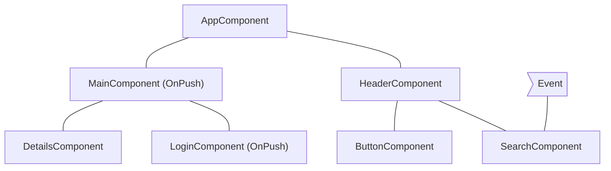
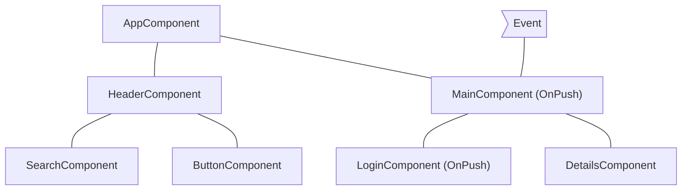
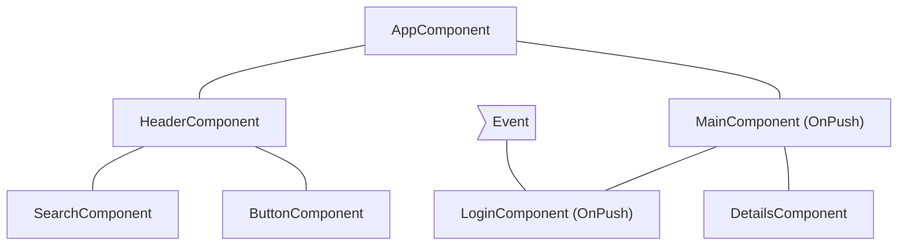
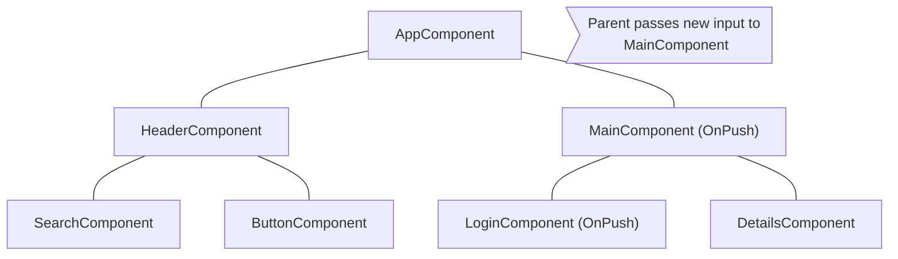

# نادیده‌گرفتن زیر‌درخت‌های کامپوننت

JavaScript به‌طور پیش‌فرض از ساختارهای دادهٔ تغییرپذیر استفاده می‌کند که چند کامپوننت مختلف می‌توانند به آن‌ها ارجاع دهند. Angular برای اطمینان از انعکاس تازه‌ترین وضعیت ساختارهای داده در DOM، change detection را روی کل درخت کامپوننت اجرا می‌کند.

Change detection برای بیشتر برنامه‌ها به‌اندازهٔ کافی سریع است. با این حال، اجرای آن روی کل یک برنامه با درخت کامپوننت بسیار بزرگ می‌تواند مشکل عملکردی ایجاد کند. برای رفع این مشکل می‌توانید change detection را طوری پیکربندی کنید که فقط روی بخشی از درخت کامپوننت اجرا شود.

## استفاده از `OnPush`

از Angular v22، راهبرد پیش‌فرض change detection برابر OnPush است. این راهبرد به Angular می‌گوید change detection را برای یک زیر‌درخت کامپوننت **فقط** در شرایط زیر اجرا کند:

- کامپوننت ریشهٔ زیر‌درخت، در نتیجهٔ binding در template ورودی جدیدی دریافت کند. Angular مقدار فعلی و قبلی ورودی را با `==` مقایسه می‌کند.
- Angular رویدادی را _(برای مثال با event binding، output binding یا `@HostListener`)_ در کامپوننت ریشهٔ زیر‌درخت یا یکی از فرزندان آن مدیریت کند؛ فارغ از اینکه آن‌ها از OnPush استفاده می‌کنند یا نه.

## سناریوهای رایج change detection

این بخش چند سناریوی رایج را برای روشن‌شدن رفتار Angular بررسی می‌کند.

### مدیریت یک رویداد توسط کامپوننتی با change detection از نوع `Eager`

اگر Angular رویدادی را در کامپوننتی با راهبرد `Eager` مدیریت کند، change detection را روی کل درخت کامپوننت اجرا می‌کند. زیر‌درخت‌هایی که ریشهٔ آن‌ها از `OnPush` استفاده می‌کند و ورودی جدیدی نگرفته‌اند، نادیده گرفته می‌شوند.

برای نمونه، اگر راهبرد change detection در `MainComponent` را روی `OnPush` بگذاریم و کاربر با کامپوننتی خارج از زیر‌درخت ریشه‌دار در `MainComponent` تعامل کند، Angular همهٔ کامپوننت‌های صورتی نمودار زیر (`AppComponent`، `HeaderComponent`، `SearchComponent` و `ButtonComponent`) را بررسی می‌کند؛ مگر آنکه `MainComponent` ورودی جدیدی دریافت کند:

## مدیریت یک رویداد توسط کامپوننتی با OnPush

اگر Angular رویدادی را در کامپوننتی با راهبرد OnPush مدیریت کند، change detection را در کل درخت کامپوننت اجرا می‌کند. زیر‌درخت‌هایی با ریشهٔ OnPush که ورودی جدید نگرفته‌اند و خارج از کامپوننت مدیریت‌کنندهٔ رویداد قرار دارند، نادیده گرفته می‌شوند.

برای نمونه، اگر Angular رویدادی را در `MainComponent` مدیریت کند، change detection در کل درخت اجرا می‌شود. زیر‌درخت ریشه‌دار در `LoginComponent` نادیده گرفته می‌شود، زیرا راهبرد آن `OnPush` است و رویداد خارج از محدودهٔ آن رخ داده است.

## مدیریت رویداد توسط یکی از فرزندان کامپوننت OnPush

اگر Angular رویدادی را در کامپوننتی با OnPush مدیریت کند، change detection را در کل درخت کامپوننت، از جمله اجداد آن کامپوننت، اجرا می‌کند.

برای نمونه، در نمودار زیر Angular رویدادی را در `LoginComponent` که از OnPush استفاده می‌کند مدیریت می‌کند. Angular در کل زیر‌درخت، از جمله `MainComponent` (والد `LoginComponent`)، change detection را فراخوانی می‌کند؛ هرچند `MainComponent` نیز OnPush است. دلیل بررسی `MainComponent` این است که `LoginComponent` بخشی از view آن محسوب می‌شود.

## ورودی‌های جدید برای کامپوننت OnPush

وقتی یک ویژگی ورودی در نتیجهٔ binding در template تنظیم شود، Angular در کامپوننت فرزند دارای `OnPush`، change detection را اجرا می‌کند.

برای مثال، در نمودار زیر `AppComponent` ورودی جدیدی به `MainComponent` دارای `OnPush` می‌دهد. Angular در `MainComponent` change detection را اجرا می‌کند، اما آن را در `LoginComponent` که آن هم `OnPush` است اجرا نمی‌کند؛ مگر آنکه آن کامپوننت نیز ورودی جدیدی دریافت کند.

## موارد خاص

- **تغییر ویژگی‌های ورودی در کد TypeScript**. وقتی با APIهایی مانند `@ViewChild` یا `@ContentChild` در TypeScript به یک کامپوننت ارجاع می‌گیرید و ویژگی `@Input` را دستی تغییر می‌دهید، Angular برای کامپوننت‌های OnPush به‌صورت خودکار change detection را اجرا نمی‌کند. اگر اجرای آن لازم است، `ChangeDetectorRef` را در کامپوننت inject کنید و با فراخوانی `changeDetectorRef.markForCheck()` از Angular بخواهید یک change detection زمان‌بندی کند.
- **تغییر اشیاء بدون تغییر reference**. اگر یک ورودی شیئی تغییرپذیر دریافت کند و شما محتوای شیء را بدون تغییر reference آن عوض کنید، Angular change detection را فراخوانی نمی‌کند. این رفتار مورد انتظار است، زیرا مقدار قبلی و فعلی ورودی به reference یکسانی اشاره می‌کنند.
