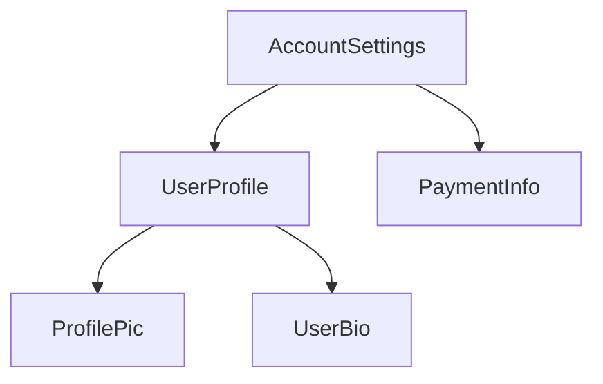

<docs-decorative-header title="ساختار یک کامپوننت" imgSrc="adev/src/assets/images/components.svg"> <!-- markdownlint-disable-line -->
</docs-decorative-header>

TIP: این راهنما فرض می‌کند قبلاً [راهنمای Essentials](essentials) را خوانده‌اید. اگر تازه با Angular آشنا شده‌اید، اول آن را بخوانید.

هر کامپوننت باید این‌ها را داشته باشد:

- یک class در TypeScript با _behavior_هایی مثل مدیریت ورودی کاربر و fetch کردن data از server
- یک template از جنس HTML که کنترل می‌کند چه چیزی در DOM render شود
- یک [CSS selector](https://developer.mozilla.org/docs/Learn/CSS/Building_blocks/Selectors) که مشخص می‌کند کامپوننت چطور در HTML استفاده می‌شود

اطلاعات مخصوص Angular برای یک کامپوننت را با اضافه کردن یک [decorator](https://www.typescriptlang.org/docs/handbook/decorators.html) به نام `@Component` روی class مربوط به TypeScript فراهم می‌کنید:

```angular-ts {highlight: [1, 2, 3, 4]}
@Component({
  selector: 'profile-photo',
  template: ``,
})
export class ProfilePhoto {}
```

برای جزئیات کامل درباره نوشتن templateهای Angular، شامل data binding، مدیریت event و control flow، [راهنمای Templateها](guide/templates) را ببینید.

objectای که به decorator مربوط به `@Component` پاس داده می‌شود **metadata** کامپوننت نام دارد. این metadata شامل `selector`، `template` و propertyهای دیگری است که در سراسر این راهنما توضیح داده می‌شوند.

کامپوننت‌ها می‌توانند به صورت اختیاری لیستی از styleهای CSS داشته باشند که روی DOM همان کامپوننت اعمال می‌شود:

```angular-ts {highlight: [4]}
@Component({
  selector: 'profile-photo',
  template: ``,
  styles: `
    img {
      border-radius: 50%;
    }
  `,
})
export class ProfilePhoto {}
```

به صورت پیش‌فرض، styleهای یک کامپوننت فقط روی elementهایی اثر می‌گذارند که در template همان کامپوننت تعریف شده‌اند. برای جزئیات درباره رویکرد Angular به styling، [Styling Components](guide/components/styling) را ببینید.

همچنین می‌توانید انتخاب کنید template و styleها را در فایل‌های جداگانه بنویسید:

```ts {highlight: [3,4]}
@Component({
  selector: 'profile-photo',
  templateUrl: 'profile-photo.html',
  styleUrl: 'profile-photo.css',
})
export class ProfilePhoto {}
```

این کار می‌تواند به جدا کردن concern مربوط به _presentation_ از _behavior_ در پروژه کمک کند. می‌توانید یک رویکرد را برای کل پروژه انتخاب کنید، یا برای هر کامپوننت جداگانه تصمیم بگیرید از کدام استفاده کنید.

هر دو `templateUrl` و `styleUrl` نسبت به directoryای هستند که کامپوننت در آن قرار دارد.

## استفاده از کامپوننت‌ها

### importها در decorator مربوط به `@Component`

برای استفاده از یک کامپوننت، [directive](guide/directives) یا [pipe](guide/templates/pipes)، باید آن را به آرایه `imports` در decorator مربوط به `@Component` اضافه کنید:

```ts
import {ProfilePhoto} from './profile-photo';

@Component({
  // Import the `ProfilePhoto` component in
  // order to use it in this component's template.
  imports: [ProfilePhoto],
  /* ... */
})
export class UserProfile {}
```

به صورت پیش‌فرض، کامپوننت‌های Angular _standalone_ هستند؛ یعنی می‌توانید آن‌ها را مستقیماً به آرایه `imports` کامپوننت‌های دیگر اضافه کنید. کامپوننت‌هایی که با نسخه‌های قدیمی‌تر Angular ساخته شده‌اند ممکن است در decorator مربوط به `@Component` مقدار `standalone: false` را مشخص کنند. برای این کامپوننت‌ها، به جای خود کامپوننت، `NgModule`ای را import می‌کنید که کامپوننت در آن تعریف شده است. برای جزئیات، [راهنمای کامل `NgModule`](guide/ngmodules/overview) را ببینید.

IMPORTANT: در نسخه‌های Angular قبل از 19.0.0، option مربوط به `standalone` به صورت پیش‌فرض `false` است.

### نمایش کامپوننت‌ها در template

هر کامپوننت یک [CSS selector](https://developer.mozilla.org/docs/Learn/CSS/Building_blocks/Selectors) تعریف می‌کند:

```angular-ts {highlight: [2]}
@Component({
  selector: 'profile-photo',
  ...
})
export class ProfilePhoto { }
```

برای جزئیات درباره اینکه Angular از چه نوع selectorهایی پشتیبانی می‌کند و چطور selector انتخاب کنید، [Component Selectors](guide/components/selectors) را ببینید.

یک کامپوننت را با ساختن یک HTML element مطابق در template کامپوننت‌های _دیگر_ نمایش می‌دهید:

```angular-ts {highlight: [8]}
@Component({
  selector: 'profile-photo',
})
export class ProfilePhoto {}

@Component({
  imports: [ProfilePhoto],
  template: `<profile-photo />`,
})
export class UserProfile {}
```

Angular برای هر HTML element مطابقی که پیدا کند، یک instance از کامپوننت می‌سازد. DOM elementای که با selector یک کامپوننت match می‌شود، **host element** آن کامپوننت نام دارد. محتوای template یک کامپوننت داخل host element آن render می‌شود.

DOMای که توسط یک کامپوننت render می‌شود و با template آن کامپوننت متناظر است، **view** آن کامپوننت نام دارد.

وقتی کامپوننت‌ها را به این شکل compose می‌کنید، **می‌توانید برنامه Angular خود را مثل یک tree از کامپوننت‌ها تصور کنید**.



این ساختار tree برای فهم چند مفهوم دیگر Angular مهم است، از جمله [dependency injection](guide/di) و [child queries](guide/components/queries).

