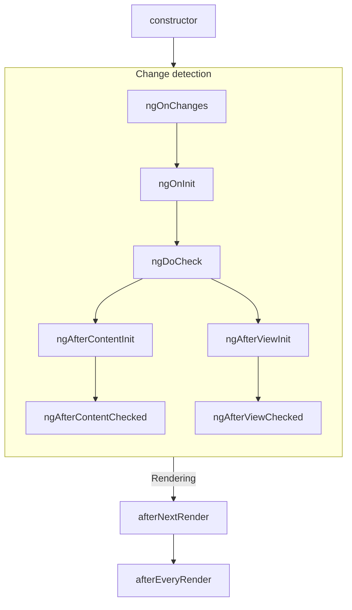
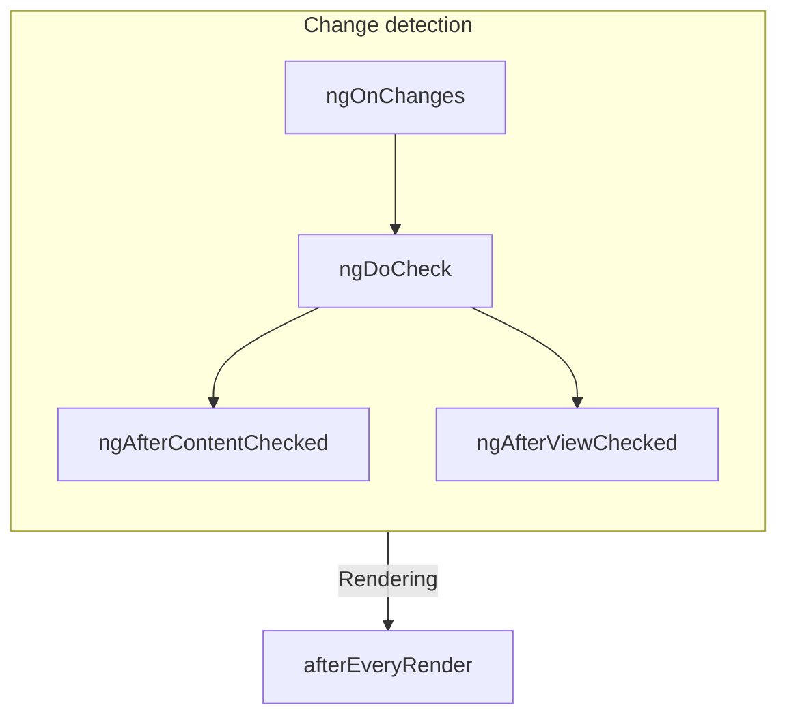

# Lifecycle component

TIP: این راهنما فرض می‌کند که قبلا [راهنمای Essentials](essentials) را خوانده‌اید. اگر با Angular تازه شروع کرده‌اید، اول آن را بخوانید.

**lifecycle** یک component توالی stepهایی است که بین ایجاد component و نابودی آن رخ می‌دهد. هر step نماینده بخش متفاوتی از فرایند Angular برای render کردن componentها و بررسی updateهای آن‌ها در طول زمان است.

در componentهای خود می‌توانید **lifecycle hookها** را پیاده‌سازی کنید تا در طول این stepها کد اجرا شود.
Lifecycle hookهایی که به یک instance مشخص از component مربوط‌اند، به‌صورت method روی کلاس component پیاده‌سازی می‌شوند. Lifecycle hookهایی که به کل application Angular مربوط‌اند، به‌صورت functionهایی پیاده‌سازی می‌شوند که یک callback می‌پذیرند.

Lifecycle یک component ارتباط تنگاتنگی با نحوه بررسی تغییرات componentهای شما توسط Angular در طول زمان دارد. برای فهم این lifecycle، کافی است بدانید Angular درخت application شما را از بالا به پایین پیمایش می‌کند و template bindingها را برای تغییرات بررسی می‌کند. Lifecycle hookهایی که در ادامه توضیح داده شده‌اند، هنگام همین traversal اجرا می‌شوند. این traversal هر component را دقیقا یک بار visit می‌کند؛ بنابراین همیشه باید از ایجاد تغییرات state بیشتر در میانه این فرایند پرهیز کنید.

## خلاصه

<div class="docs-table docs-scroll-track-transparent">
  <table>
    <tr>
      <td><strong>Phase</strong></td>
      <td><strong>Method</strong></td>
      <td><strong>Summary</strong></td>
    </tr>
    <tr>
      <td>Creation</td>
      <td><code>constructor</code></td>
      <td>
        <a href="https://developer.mozilla.org/docs/Web/JavaScript/Reference/Classes/constructor" target="_blank">
          constructor استاندارد کلاس JavaScript
        </a>. زمانی اجرا می‌شود که Angular component را instantiate می‌کند.
      </td>
    </tr>
    <tr>
      <td rowspan="7">Change<p>Detection</td>
      <td><code>ngOnInit</code>
      </td>
      <td>یک بار بعد از اینکه Angular همه inputهای component را initialize کرد اجرا می‌شود.</td>
    </tr>
    <tr>
      <td><code>ngOnChanges</code></td>
      <td>هر بار که inputهای component تغییر کرده باشند اجرا می‌شود.</td>
    </tr>
    <tr>
      <td><code>ngDoCheck</code></td>
      <td>هر بار که این component برای تغییرات check می‌شود اجرا می‌شود.</td>
    </tr>
    <tr>
      <td><code>ngAfterContentInit</code></td>
      <td>یک بار بعد از initialize شدن <em>content</em> component اجرا می‌شود.</td>
    </tr>
    <tr>
      <td><code>ngAfterContentChecked</code></td>
      <td>هر بار که content این component برای تغییرات check شده باشد اجرا می‌شود.</td>
    </tr>
    <tr>
      <td><code>ngAfterViewInit</code></td>
      <td>یک بار بعد از initialize شدن <em>view</em> component اجرا می‌شود.</td>
    </tr>
    <tr>
      <td><code>ngAfterViewChecked</code></td>
      <td>هر بار که view component برای تغییرات check شده باشد اجرا می‌شود.</td>
    </tr>
    <tr>
      <td rowspan="2">Rendering</td>
      <td><code>afterNextRender</code></td>
      <td>یک بار، دفعه بعدی که <strong>همه</strong> componentها در DOM render شدند، اجرا می‌شود.</td>
    </tr>
    <tr>
      <td><code>afterEveryRender</code></td>
      <td>هر بار که <strong>همه</strong> componentها در DOM render شدند اجرا می‌شود.</td>
    </tr>
    <tr>
      <td>Destruction</td>
      <td><code>ngOnDestroy</code></td>
      <td>یک بار پیش از destroy شدن component اجرا می‌شود.</td>
    </tr>
  </table>
</div>

### ngOnInit

متد `ngOnInit` بعد از اینکه Angular همه inputهای component را با مقدارهای اولیه‌شان initialize کرد اجرا می‌شود. `ngOnInit` یک component دقیقا یک بار اجرا می‌شود.

این step _قبل از_ initialize شدن template خود component رخ می‌دهد. یعنی می‌توانید state مربوط به component را بر اساس مقدارهای اولیه inputهای آن update کنید.

### ngOnChanges

متد `ngOnChanges` بعد از تغییر هرکدام از inputهای component اجرا می‌شود.

این step _قبل از_ check شدن template خود component رخ می‌دهد. یعنی می‌توانید state مربوط به component را بر اساس مقدارهای اولیه inputهای آن update کنید.

در زمان initialization، اولین `ngOnChanges` پیش از `ngOnInit` اجرا می‌شود.

#### بررسی تغییرات

متد `ngOnChanges` یک argument از نوع `SimpleChanges` می‌پذیرد. این object یک [`Record`](https://www.typescriptlang.org/docs/handbook/utility-types.html#recordkeys-type) است که هر نام input مربوط به component را به یک object از نوع `SimpleChange` map می‌کند. هر `SimpleChange` شامل مقدار قبلی input، مقدار فعلی آن و یک flag است که مشخص می‌کند آیا این اولین بار است که input تغییر کرده یا نه.

برای type checking قوی‌تر، می‌توانید کلاس فعلی یا `this` را به‌عنوان اولین generic argument پاس دهید.

```ts
@Component({
  /* ... */
})
export class UserProfile {
  name = input('');

  ngOnChanges(changes: SimpleChanges<UserProfile>) {
    if (changes.name) {
      console.log(`Previous: ${changes.name.previousValue}`);
      console.log(`Current: ${changes.name.currentValue}`);
      console.log(`Is first ${changes.name.firstChange}`);
    }
  }
}
```

اگر برای هرکدام از input propertyها یک `alias` فراهم کنید، `SimpleChanges` Record همچنان از نام TypeScript property به‌عنوان key استفاده می‌کند، نه از alias.

### ngOnDestroy

متد `ngOnDestroy` یک بار، درست پیش از destroy شدن component اجرا می‌شود. Angular زمانی یک component را destroy می‌کند که دیگر روی page نمایش داده نشود، مثل زمانی که با `@if` hidden می‌شود یا هنگام navigate به page دیگر.

#### DestroyRef

به‌عنوان جایگزین متد `ngOnDestroy`، می‌توانید یک instance از `DestroyRef` را inject کنید. می‌توانید با فراخوانی متد `onDestroy` مربوط به `DestroyRef` یک callback ثبت کنید تا هنگام destruction component invoke شود.

```ts
@Component({
  /* ... */
})
export class UserProfile {
  constructor() {
    inject(DestroyRef).onDestroy(() => {
      console.log('UserProfile destruction');
    });
  }
}
```

می‌توانید instance مربوط به `DestroyRef` را به functionها یا classهای بیرون از component خود پاس دهید. اگر کد دیگری دارید که باید هنگام destroy شدن component رفتار cleanup اجرا کند، از این pattern استفاده کنید.

همچنین می‌توانید از `DestroyRef` استفاده کنید تا setup code نزدیک cleanup code بماند، به‌جای اینکه همه cleanup code را در متد `ngOnDestroy` قرار دهید.

##### تشخیص destroy شدن instance

`DestroyRef` یک property به نام `destroyed` ارائه می‌دهد که اجازه می‌دهد بررسی کنید آیا یک instance مشخص قبلا destroy شده یا نه. این برای جلوگیری از انجام عملیات روی componentهای destroy شده مفید است، به‌خصوص هنگام کار با logicهای تاخیری یا asynchronous.

با بررسی `destroyRef.destroyed` می‌توانید از اجرای کد پس از cleanup شدن instance جلوگیری کنید و از خطاهای احتمالی مثل `NG0911: View has already been destroyed.` دور بمانید.

### ngDoCheck

متد `ngDoCheck` پیش از هر بار که Angular template یک component را برای تغییرات check می‌کند اجرا می‌شود.

می‌توانید از این lifecycle hook استفاده کنید تا تغییرات state خارج از change detection عادی Angular را به‌صورت دستی check کنید و state مربوط به component را به‌صورت دستی update کنید.

این متد بسیار پرتکرار اجرا می‌شود و می‌تواند به‌شکل قابل‌توجهی روی performance page شما اثر بگذارد. تا جای ممکن از تعریف این hook پرهیز کنید و فقط زمانی از آن استفاده کنید که هیچ جایگزینی ندارید.

در زمان initialization، اولین `ngDoCheck` بعد از `ngOnInit` اجرا می‌شود.

### ngAfterContentInit

متد `ngAfterContentInit` یک بار بعد از initialize شدن همه childهایی که داخل component nest شده‌اند، یعنی _content_ آن، اجرا می‌شود.

می‌توانید از این lifecycle hook برای خواندن نتیجه [content queryها](guide/components/queries#content-queries) استفاده کنید. با اینکه می‌توانید به state initialize شده این queryها دسترسی داشته باشید، تلاش برای تغییر دادن هر state در این متد به [ExpressionChangedAfterItHasBeenCheckedError](errors/NG0100) منجر می‌شود.

### ngAfterContentChecked

متد `ngAfterContentChecked` هر بار که childهای nest شده داخل component، یعنی _content_ آن، برای تغییرات check شده باشند اجرا می‌شود.

این متد بسیار پرتکرار اجرا می‌شود و می‌تواند به‌شکل قابل‌توجهی روی performance page شما اثر بگذارد. تا جای ممکن از تعریف این hook پرهیز کنید و فقط زمانی از آن استفاده کنید که هیچ جایگزینی ندارید.

با اینکه می‌توانید در اینجا به state update شده [content queryها](guide/components/queries#content-queries) دسترسی داشته باشید، تلاش برای تغییر دادن هر state در این متد به [ExpressionChangedAfterItHasBeenCheckedError](errors/NG0100) منجر می‌شود.

### ngAfterViewInit

متد `ngAfterViewInit` یک بار بعد از initialize شدن همه childهای داخل template component، یعنی _view_ آن، اجرا می‌شود.

می‌توانید از این lifecycle hook برای خواندن نتیجه [view queryها](guide/components/queries#view-queries) استفاده کنید. با اینکه می‌توانید به state initialize شده این queryها دسترسی داشته باشید، تلاش برای تغییر دادن هر state در این متد به [ExpressionChangedAfterItHasBeenCheckedError](errors/NG0100) منجر می‌شود.

### ngAfterViewChecked

متد `ngAfterViewChecked` هر بار که childهای داخل template component، یعنی _view_ آن، برای تغییرات check شده باشند اجرا می‌شود.

این متد بسیار پرتکرار اجرا می‌شود و می‌تواند به‌شکل قابل‌توجهی روی performance page شما اثر بگذارد. تا جای ممکن از تعریف این hook پرهیز کنید و فقط زمانی از آن استفاده کنید که هیچ جایگزینی ندارید.

با اینکه می‌توانید در اینجا به state update شده [view queryها](guide/components/queries#view-queries) دسترسی داشته باشید، تلاش برای تغییر دادن هر state در این متد به [ExpressionChangedAfterItHasBeenCheckedError](errors/NG0100) منجر می‌شود.

### afterEveryRender و afterNextRender

تابع‌های `afterEveryRender` و `afterNextRender` اجازه می‌دهند یک **render callback** ثبت کنید تا بعد از اینکه Angular render کردن _همه componentها_ در page را داخل DOM تمام کرد invoke شود.

این functionها با lifecycle hookهای دیگری که در این راهنما توضیح داده شدند متفاوت‌اند. به‌جای اینکه method کلاس باشند، functionهای standalone هستند که یک callback می‌پذیرند. اجرای render callbackها به هیچ instance مشخصی از component وابسته نیست و در عوض یک hook در سطح کل application است.

`afterEveryRender` و `afterNextRender` باید در یک [injection context](guide/di/dependency-injection-context) فراخوانی شوند، معمولا constructor یک component.

می‌توانید از render callbackها برای انجام عملیات دستی DOM استفاده کنید.
برای راهنمایی درباره کار با DOM در Angular، [Using DOM APIs](guide/components/dom-apis) را ببینید.

Render callbackها هنگام server-side rendering یا build-time pre-rendering اجرا نمی‌شوند.

#### فازهای after\*Render

هنگام استفاده از `afterEveryRender` یا `afterNextRender`، می‌توانید کار را به‌صورت اختیاری به phaseها تقسیم کنید. phase به شما کنترل روی sequencing عملیات DOM می‌دهد و اجازه می‌دهد عملیات _write_ را قبل از عملیات _read_ ترتیب دهید تا [layout thrashing](https://web.dev/avoid-large-complex-layouts-and-layout-thrashing) کمینه شود. برای ارتباط میان phaseها، یک phase function می‌تواند یک result value برگرداند که در phase بعدی قابل دسترسی باشد.

```ts
import {Component, ElementRef, afterNextRender} from '@angular/core';

@Component(/* ... */)
export class UserProfile {
  private prevPadding = 0;
  private elementHeight = 0;

  constructor() {
    const elementRef = inject(ElementRef);
    const nativeElement = elementRef.nativeElement;

    afterNextRender({
      // Use the `Write` phase to write to a geometric property.
      write: () => {
        const padding = computePadding();
        const changed = padding !== this.prevPadding;
        if (changed) {
          nativeElement.style.padding = padding;
        }
        return changed; // Communicate whether anything changed to the read phase.
      },

      // Use the `Read` phase to read geometric properties after all writes have occurred.
      read: (didWrite) => {
        if (didWrite) {
          this.elementHeight = nativeElement.getBoundingClientRect().height;
        }
      },
    });
  }
}
```

چهار phase وجود دارد که به ترتیب زیر اجرا می‌شوند:

| Phase            | Description                                                                                                                                                                                                      |
| ---------------- | ---------------------------------------------------------------------------------------------------------------------------------------------------------------------------------------------------------------- |
| `earlyRead`      | از این phase برای خواندن propertyها و styleهای DOM که روی layout اثر می‌گذارند و برای محاسبه بعدی کاملا ضروری‌اند استفاده کنید. اگر ممکن است از این phase پرهیز کنید و phaseهای `write` و `read` را ترجیح دهید. |
| `write`          | از این phase برای نوشتن propertyها و styleهای DOM که روی layout اثر می‌گذارند استفاده کنید.                                                                                                                     |
| `mixedReadWrite` | phase پیش‌فرض. برای عملیات‌هایی استفاده می‌شود که هم باید propertyها و styleهای موثر بر layout را بخوانند و هم بنویسند. اگر ممکن است از این phase پرهیز کنید و phaseهای explicit یعنی `write` و `read` را ترجیح دهید. |
| `read`           | از این phase برای خواندن هر property مربوط به DOM که روی layout اثر می‌گذارد استفاده کنید.                                                                                                                       |

## Interfaceهای lifecycle

Angular برای هر lifecycle method یک TypeScript interface ارائه می‌دهد. می‌توانید این interfaceها را به‌صورت اختیاری import و `implement` کنید تا مطمئن شوید پیاده‌سازی شما typo یا غلط املایی ندارد.

هر interface همان نام method متناظر را بدون prefix مربوط به `ng` دارد. برای مثال، interface مربوط به `ngOnInit` برابر `OnInit` است.

```ts
@Component({
  /* ... */
})
export class UserProfile implements OnInit {
  ngOnInit() {
    /* ... */
  }
}
```

## ترتیب اجرا

نمودارهای زیر ترتیب اجرای lifecycle hookهای Angular را نشان می‌دهند.

### هنگام initialization



### updateهای بعدی



### ترتیب همراه directiveها

وقتی یک یا چند directive را روی همان element یک component قرار می‌دهید، چه در template و چه با property مربوط به `hostDirectives`، framework هیچ ترتیبی را برای lifecycle hook مشخص بین component و directiveهای روی یک element تضمین نمی‌کند. هرگز به ترتیبی که مشاهده کرده‌اید وابسته نشوید، چون ممکن است در نسخه‌های بعدی Angular تغییر کند.
