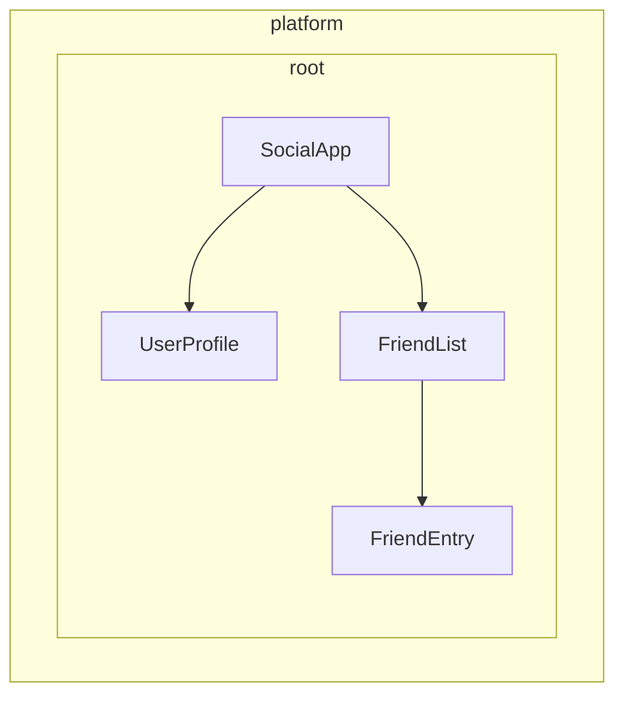

# تعریف dependency providerها

Angular دو راه برای در دسترس قرار دادن serviceها برای injection فراهم می‌کند:

1. **Automatic provision** - با استفاده از `providedIn` در decorator مربوط به `@Injectable`، decorator مربوط به [`@Service`](guide/di/creating-and-using-services#using-the-service-vs-injectable-decorator)، یا با فراهم کردن factory در configuration مربوط به `InjectionToken`
2. **Manual provision** - با استفاده از array مربوط به `providers` در componentها، directiveها، routeها یا application config

در [راهنمای قبلی](/guide/di/creating-and-using-services)، یاد گرفتید چگونه serviceها را با `providedIn: 'root'` بسازید؛ حالتی که بیشتر use caseهای رایج را پوشش می‌دهد. این راهنما patternهای اضافه‌ای را برای automatic و manual provider configuration بررسی می‌کند.

## Automatic provision برای dependencyهای غیر class

با اینکه decorator مربوط به `@Injectable` همراه با `providedIn: 'root'` برای serviceها یا classها عالی کار می‌کند، ممکن است لازم باشد نوع‌های دیگری از value را به‌صورت global provide کنید، مثل configuration objectها، functionها یا primitive valueها. Angular برای این هدف `InjectionToken` را فراهم می‌کند.

### InjectionToken چیست؟

یک `InjectionToken` objectی است که dependency injection system در Angular برای شناسایی یکتای valueها هنگام injection استفاده می‌کند. آن را مثل یک key ویژه تصور کنید که اجازه می‌دهد هر نوع value را در DI system مربوط به Angular ذخیره و retrieve کنید:

```ts
import {InjectionToken} from '@angular/core';

// Create a token for a string value
export const API_URL = new InjectionToken<string>('api.url');

// Create a token for a function
export const LOGGER = new InjectionToken<(msg: string) => void>('logger.function');

// Create a token for a complex type
export interface Config {
  apiUrl: string;
  timeout: number;
}
export const CONFIG_TOKEN = new InjectionToken<Config>('app.config');
```

NOTE: پارامتر string، مثل `'api.url'`، فقط برای debugging یک description است؛ Angular tokenها را با object reference آن‌ها شناسایی می‌کند، نه با این string.

### InjectionToken با `providedIn: 'root'`

یک `InjectionToken` که `factory` داشته باشد، به‌صورت پیش‌فرض نتیجه‌ای مثل `providedIn: 'root'` دارد، هرچند می‌توان آن را با prop مربوط به `providedIn` override کرد.

```ts
// 📁 /app/config.token.ts
import {InjectionToken} from '@angular/core';

export interface AppConfig {
  apiUrl: string;
  version: string;
  features: Record<string, boolean>;
}

// Globally available configuration using providedIn
export const APP_CONFIG = new InjectionToken<AppConfig>('app.config', {
  providedIn: 'root',
  factory: () => ({
    apiUrl: 'https://api.example.com',
    version: '1.0.0',
    features: {
      darkMode: true,
      analytics: false,
    },
  }),
});

// No need to add to providers array - available everywhere!
@Component({
  selector: 'app-header',
  template: `<h1>Version: {{ config.version }}</h1>`,
})
export class Header {
  config = inject(APP_CONFIG); // Automatically available
}
```

### چه زمانی از InjectionToken با factory function استفاده کنیم

InjectionToken همراه با factory function زمانی ایده‌آل است که نمی‌توانید از class استفاده کنید اما لازم است dependencyها را به‌صورت global provide کنید:

```ts
// 📁 /app/logger.token.ts
import {InjectionToken, inject} from '@angular/core';
import {APP_CONFIG} from './config.token';

// Logger function type
export type LoggerFn = (level: string, message: string) => void;

// Global logger function with dependencies
export const LOGGER_FN = new InjectionToken<LoggerFn>('logger.function', {
  providedIn: 'root',
  factory: () => {
    const config = inject(APP_CONFIG);

    return (level: string, message: string) => {
      if (config.features.logging !== false) {
        console[level](`[${new Date().toISOString()}] ${message}`);
      }
    };
  },
});

// 📁 /app/storage.token.ts
// Providing browser APIs as tokens
export const LOCAL_STORAGE = new InjectionToken<Storage>('localStorage', {
  // providedIn: 'root' is configured as the default
  factory: () => window.localStorage,
});

export const SESSION_STORAGE = new InjectionToken<Storage>('sessionStorage', {
  providedIn: 'root',
  factory: () => window.sessionStorage,
});

// 📁 /app/feature-flags.token.ts
// Complex configuration with runtime logic
export const FEATURE_FLAGS = new InjectionToken<Map<string, boolean>>('feature.flags', {
  providedIn: 'root',
  factory: () => {
    const flags = new Map<string, boolean>();

    // Parse from environment or URL params
    const urlParams = new URLSearchParams(window.location.search);
    const enableBeta = urlParams.get('beta') === 'true';

    flags.set('betaFeatures', enableBeta);
    flags.set('darkMode', true);
    flags.set('newDashboard', false);

    return flags;
  },
});
```

این approach چند مزیت دارد:

- **نیازی به provider configuration دستی ندارد** - درست مثل `providedIn: 'root'` برای serviceها کار می‌کند
- **Tree-shakeable** - فقط اگر واقعا استفاده شود include می‌شود
- **Type-safe** - پشتیبانی کامل TypeScript برای valueهای غیر class
- **می‌تواند dependencyهای دیگر را inject کند** - factory functionها می‌توانند از `inject()` برای دسترسی به serviceهای دیگر استفاده کنند

## درک manual provider configuration

وقتی به کنترل بیشتری نسبت به `providedIn: 'root'` نیاز دارید، می‌توانید providerها را دستی configure کنید. Manual configuration از طریق array مربوط به `providers` زمانی مفید است که:

1. **Service، `providedIn` ندارد** - Serviceهای بدون automatic provision باید دستی provide شوند
2. **یک instance جدید می‌خواهید** - برای ساخت instance جداگانه در سطح component/directive به‌جای استفاده از instance shared
3. **به runtime configuration نیاز دارید** - وقتی behavior مربوط به service به runtime valueها وابسته است
4. **valueهای غیر class را provide می‌کنید** - configuration objectها، functionها یا primitive valueها

### مثال: Service بدون `providedIn`

```ts
import {Injectable, Component, inject} from '@angular/core';

// Service without providedIn
@Injectable()
export class LocalDataStore {
  private data: string[] = [];

  addData(item: string) {
    this.data.push(item);
  }
}

// Component must provide it
@Component({
  selector: 'app-example',
  // A provider is required here because the `LocalDataStore` service has no providedIn.
  providers: [LocalDataStore],
  template: `...`,
})
export class Example {
  dataStore = inject(LocalDataStore);
}
```

### مثال: ساخت instanceهای مخصوص component

Serviceهایی با `providedIn: 'root'` می‌توانند در سطح component override شوند. این کار instance مربوط به service را به lifetime یک component گره می‌زند. در نتیجه، وقتی component destroy شود، service provide شده هم destroy می‌شود.

```ts
import {Injectable, Component, inject} from '@angular/core';

@Injectable({providedIn: 'root'})
export class DataStore {
  private data: ListItem[] = [];
}

// This component gets its own instance
@Component({
  selector: 'app-isolated',
  // Creates new instance of `DataStore` rather than using the root-provided instance.
  providers: [DataStore],
  template: `...`,
})
export class Isolated {
  dataStore = inject(DataStore); // Component-specific instance
}
```

## Hierarchy مربوط به injector در Angular

Dependency injection system در Angular hierarchical است. وقتی یک component dependencyای request می‌کند، Angular از injector همان component شروع می‌کند و در tree بالا می‌رود تا provider مربوط به آن dependency را پیدا کند. هر component در application tree شما می‌تواند injector خودش را داشته باشد، و این injectorها hierarchyای می‌سازند که component tree شما را mirror می‌کند.

این hierarchy این موارد را ممکن می‌کند:

- **Scoped instanceها**: بخش‌های مختلف app شما می‌توانند instanceهای متفاوتی از یک service داشته باشند
- **Override behavior**: componentهای child می‌توانند providerهای componentهای parent را override کنند
- **Memory efficiency**: serviceها فقط جایی instantiate می‌شوند که لازم است

در Angular، هر elementی که component یا directive دارد می‌تواند valueها را برای همه descendantهای خود provide کند.



در مثال بالا:

1. `SocialApp` می‌تواند valueهایی برای `UserProfile` و `FriendList` provide کند
2. `FriendList` می‌تواند valueهایی را برای injection در `FriendEntry` provide کند، اما نمی‌تواند برای injection در `UserProfile` value provide کند چون `UserProfile` بخشی از tree آن نیست

## Declare کردن provider

Dependency injection system در Angular را مثل یک hash map یا dictionary تصور کنید. هر provider configuration object یک key-value pair تعریف می‌کند:

- **Key یا Provider identifier**: شناسه یکتایی که برای request کردن dependency استفاده می‌کنید
- **Value**: چیزی که Angular باید وقتی آن token request شد برگرداند

وقتی dependencyها را دستی provide می‌کنید، معمولا این shorthand syntax را می‌بینید:

```angular-ts
import {Component} from '@angular/core';
import {LocalService} from './local-service';

@Component({
  selector: 'app-example',
  providers: [LocalService], // Service without providedIn
})
export class Example {}
```

این در واقع shorthand برای provider configuration دقیق‌تر زیر است:

```ts
{
  // This is the shorthand version
  providers: [LocalService],

  // This is the full version
  providers: [
    { provide: LocalService, useClass: LocalService }
  ]
}
```

### Provider configuration object

هر provider configuration object دو بخش اصلی دارد:

1. **Provider identifier**: key یکتایی که Angular برای گرفتن dependency استفاده می‌کند، از طریق property مربوط به `provide` تنظیم می‌شود
2. **Value**: dependency واقعی‌ای که می‌خواهید Angular fetch کند، که با keyهای متفاوت بر اساس نوع مطلوب configure می‌شود:
   - `useClass` - یک JavaScript class provide می‌کند
   - `useValue` - یک static value provide می‌کند
   - `useFactory` - یک factory function provide می‌کند که value را برمی‌گرداند
   - `useExisting` - aliasای به یک provider موجود provide می‌کند

### Provider identifierها

Provider identifierها به dependency injection یا DI system در Angular اجازه می‌دهند یک dependency را از طریق ID یکتا retrieve کند. می‌توانید provider identifierها را به دو روش generate کنید:

1. [Class nameها](#class-names)
2. [Injection tokenها](#injection-tokens)

#### Class nameها

Class nameها از class import شده مستقیم به‌عنوان identifier استفاده می‌کنند:

```angular-ts
import {Component} from '@angular/core';
import {LocalService} from './local-service';

@Component({
  selector: 'app-example',
  providers: [{provide: LocalService, useClass: LocalService}],
})
export class Example {
  /* ... */
}
```

Class هم به‌عنوان identifier و هم به‌عنوان implementation عمل می‌کند؛ به همین دلیل Angular shorthand مربوط به `providers: [LocalService]` را فراهم می‌کند.

#### Injection tokenها

Angular یک class built-in به نام [`InjectionToken`](api/core/InjectionToken) فراهم می‌کند که یک object reference یکتا برای injectable valueها می‌سازد، یا زمانی که می‌خواهید چند implementation برای یک interface یکسان provide کنید.

```ts
// 📁 /app/tokens.ts
import {InjectionToken} from '@angular/core';
import {DataService} from './data-service.interface';

export const DATA_SERVICE_TOKEN = new InjectionToken<DataService>('DataService');
```

NOTE: string مربوط به `'DataService'` فقط برای debugging به‌عنوان description استفاده می‌شود. Angular token را با object reference آن شناسایی می‌کند، نه با این string.

Token را در provider configuration خود استفاده کنید:

```angular-ts
import {Component, inject} from '@angular/core';
import {LocalDataService} from './local-data-service';
import {DATA_SERVICE_TOKEN} from './tokens';

@Component({
  selector: 'app-example',
  providers: [{provide: DATA_SERVICE_TOKEN, useClass: LocalDataService}],
})
export class Example {
  private dataService = inject(DATA_SERVICE_TOKEN);
}
```

#### آیا TypeScript interfaceها می‌توانند identifier برای injection باشند؟

TypeScript interfaceها نمی‌توانند برای injection استفاده شوند، چون در runtime وجود ندارند:

```ts
// ❌ This won't work!
interface DataService {
  getData(): string[];
}

// Interfaces disappear after TypeScript compilation
@Component({
  providers: [
    {provide: DataService, useClass: LocalDataService}, // Error!
  ],
})
export class Example {
  private dataService = inject(DataService); // Error!
}

// ✅ Use InjectionToken instead
export const DATA_SERVICE_TOKEN = new InjectionToken<DataService>('DataService');

@Component({
  providers: [{provide: DATA_SERVICE_TOKEN, useClass: LocalDataService}],
})
export class Example {
  private dataService = inject(DATA_SERVICE_TOKEN); // Works!
}
```

`InjectionToken` یک runtime value فراهم می‌کند که DI system در Angular می‌تواند استفاده کند، در حالی که همچنان type safety از طریق generic type parameter در TypeScript حفظ می‌شود.

### نوع‌های provider value

#### useClass

`useClass` یک JavaScript class را به‌عنوان dependency provide می‌کند. هنگام استفاده از shorthand syntax، این حالت پیش‌فرض است:

```ts
// Shorthand
providers: [DataService];

// Full syntax
providers: [{provide: DataService, useClass: DataService}];

// Different implementation
providers: [{provide: DataService, useClass: MockDataService}];

// Conditional implementation
providers: [
  {
    provide: StorageService,
    useClass: environment.production ? CloudStorageService : LocalStorageService,
  },
];
```

#### مثال عملی: جایگزینی Logger

می‌توانید implementationها را برای گسترش functionality جایگزین کنید:

```ts
import {Injectable, Component, inject} from '@angular/core';

// Base logger
@Injectable()
export class Logger {
  log(message: string) {
    console.log(message);
  }
}

// Enhanced logger with timestamp
@Injectable()
export class BetterLogger extends Logger {
  override log(message: string) {
    super.log(`[${new Date().toISOString()}] ${message}`);
  }
}

// Logger that includes user context
@Injectable()
export class EvenBetterLogger extends Logger {
  private userService = inject(UserService);

  override log(message: string) {
    const name = this.userService.user.name;
    super.log(`Message to ${name}: ${message}`);
  }
}

// In your component
@Component({
  selector: 'app-example',
  providers: [
    UserService, // EvenBetterLogger needs this
    {provide: Logger, useClass: EvenBetterLogger},
  ],
})
export class Example {
  private logger = inject(Logger); // Gets EvenBetterLogger instance
}
```

#### useValue

`useValue` هر نوع data در JavaScript را به‌عنوان static value provide می‌کند:

```ts
providers: [
  {provide: API_URL_TOKEN, useValue: 'https://api.example.com'},
  {provide: MAX_RETRIES_TOKEN, useValue: 3},
  {provide: FEATURE_FLAGS_TOKEN, useValue: {darkMode: true, beta: false}},
];
```

IMPORTANT: TypeScript typeها و interfaceها نمی‌توانند به‌عنوان dependency value استفاده شوند. آن‌ها فقط در compile-time وجود دارند.

#### مثال عملی: Application configuration

یک use case رایج برای `useValue`، provide کردن application configuration است:

```ts
// Define configuration interface
export interface AppConfig {
  apiUrl: string;
  appTitle: string;
  features: {
    darkMode: boolean;
    analytics: boolean;
  };
}

// Create injection token
export const APP_CONFIG = new InjectionToken<AppConfig>('app.config');

// Define configuration
const appConfig: AppConfig = {
  apiUrl: 'https://api.example.com',
  appTitle: 'My Application',
  features: {
    darkMode: true,
    analytics: false,
  },
};

// Provide in bootstrap
bootstrapApplication(AppComponent, {
  providers: [{provide: APP_CONFIG, useValue: appConfig}],
});

// Use in component
@Component({
  selector: 'app-header',
  template: `<h1>{{ title }}</h1>`,
})
export class Header {
  private config = inject(APP_CONFIG);
  title = this.config.appTitle;
}
```

#### useFactory

`useFactory` functionی provide می‌کند که یک value جدید برای injection generate می‌کند:

```ts
export const loggerFactory = (config: AppConfig) => {
  return new LoggerService(config.logLevel, config.endpoint);
};

providers: [
  {
    provide: LoggerService,
    useFactory: loggerFactory,
    deps: [APP_CONFIG], // Dependencies for the factory function
  },
];
```

می‌توانید dependencyهای factory را optional علامت‌گذاری کنید:

```ts
import {Optional} from '@angular/core';

providers: [
  {
    provide: MyService,
    useFactory: (required: RequiredService, optional?: OptionalService) => {
      return new MyService(required, optional || new DefaultService());
    },
    deps: [RequiredService, [new Optional(), OptionalService]],
  },
];
```

#### مثال عملی: API client مبتنی بر configuration

این یک مثال کامل است که نشان می‌دهد چگونه از factory برای ساخت service با runtime configuration استفاده کنید:

```ts
// Service that needs runtime configuration
class ApiClient {
  constructor(
    private http: HttpClient,
    private baseUrl: string,
    private rateLimitMs: number,
  ) {}

  async fetchData(endpoint: string) {
    // Apply rate limiting based on user tier
    await this.applyRateLimit();
    return this.http.get(`${this.baseUrl}/${endpoint}`);
  }

  private async applyRateLimit() {
    // Simplified example - real implementation would track request timing
    return new Promise((resolve) => setTimeout(resolve, this.rateLimitMs));
  }
}

// Factory function that configures based on user tier
import {inject} from '@angular/core';
import {HttpClient} from '@angular/common/http';
const apiClientFactory = () => {
  const http = inject(HttpClient);
  const userService = inject(UserService);

  // Assuming userService provides these values
  const baseUrl = userService.getApiBaseUrl();
  const rateLimitMs = userService.getRateLimit();

  return new ApiClient(http, baseUrl, rateLimitMs);
};

// Provider configuration
export const apiClientProvider = {
  provide: ApiClient,
  useFactory: apiClientFactory,
};

// Usage in component
@Component({
  selector: 'app-dashboard',
  providers: [apiClientProvider],
})
export class Dashboard {
  private apiClient = inject(ApiClient);
}
```

#### useExisting

`useExisting` برای providerای که قبلا تعریف شده alias می‌سازد. هر دو token همان instance را برمی‌گردانند:

```ts
providers: [
  NewLogger, // The actual service
  {provide: OldLogger, useExisting: NewLogger}, // The alias
];
```

IMPORTANT: `useExisting` را با `useClass` اشتباه نگیرید. `useClass` instanceهای جداگانه می‌سازد، در حالی که `useExisting` تضمین می‌کند همان singleton instance را بگیرید.

### چند provider

وقتی چند provider به یک token یکسان value اضافه می‌کنند، از flag مربوط به `multi: true` استفاده کنید:

```ts
export const INTERCEPTOR_TOKEN = new InjectionToken<Interceptor[]>('interceptors');

providers: [
  {provide: INTERCEPTOR_TOKEN, useClass: AuthInterceptor, multi: true},
  {provide: INTERCEPTOR_TOKEN, useClass: LoggingInterceptor, multi: true},
  {provide: INTERCEPTOR_TOKEN, useClass: RetryInterceptor, multi: true},
];
```

وقتی `INTERCEPTOR_TOKEN` را inject کنید، arrayای دریافت می‌کنید که instanceهای هر سه interceptor را شامل می‌شود.

## Providerها را کجا می‌توانید مشخص کنید؟

Angular چند سطح برای register کردن providerها ارائه می‌دهد که هرکدام implicationهای متفاوتی برای scope، lifecycle و performance دارند:

- [**Application bootstrap**](#application-bootstrap) - singletonهای global که همه‌جا در دسترس‌اند
- [**روی یک element، component یا directive**](#component-or-directive-providers) - instanceهای isolated برای component treeهای مشخص
- [**Route**](#route-providers) - serviceهای مخصوص feature برای lazy-loaded moduleها

### Application bootstrap

از providerهای application-level در `bootstrapApplication` استفاده کنید وقتی:

- **Service در چند feature area استفاده می‌شود** - serviceهایی مثل HTTP clientها، logging یا authentication که بخش‌های زیادی از app به آن نیاز دارند
- **یک singleton واقعی می‌خواهید** - یک instance shared در کل application
- **Service configuration مخصوص component ندارد** - utilityهای عمومی که همه‌جا یکسان کار می‌کنند
- **Global configuration provide می‌کنید** - API endpointها، feature flagها یا environment settingها

```ts
// main.ts
bootstrapApplication(App, {
  providers: [
    {provide: API_BASE_URL, useValue: 'https://api.example.com'},
    {provide: INTERCEPTOR_TOKEN, useClass: AuthInterceptor, multi: true},
    LoggingService, // Used throughout the app
    {provide: ErrorHandler, useClass: GlobalErrorHandler},
  ],
});
```

**مزایا:**

- instance واحد memory usage را کاهش می‌دهد
- بدون setup اضافه همه‌جا در دسترس است
- مدیریت global state ساده‌تر است

**معایب:**

- همیشه در JavaScript bundle شما include می‌شود، حتی اگر value هرگز inject نشود
- به‌سادگی برای هر feature قابل customize نیست
- test کردن componentهای individual به‌صورت isolated سخت‌تر است

#### چرا هنگام bootstrap provide کنیم به‌جای استفاده از `providedIn: 'root'`؟

ممکن است provider را هنگام bootstrap بخواهید وقتی:

- provider side-effect دارد، مثل نصب client-side router
- provider به configuration نیاز دارد، مثل routeها
- از pattern مربوط به `provideSomething` در Angular استفاده می‌کنید، مثل `provideRouter` یا `provideHttpClient`

### Providerهای component یا directive

از providerهای component یا directive استفاده کنید وقتی:

- **Service state مخصوص component دارد** - form validatorها، cacheهای مخصوص component یا UI state managerها
- **به instanceهای isolated نیاز دارید** - هر component به copy خودش از service نیاز دارد
- **Service فقط توسط یک component tree استفاده می‌شود** - serviceهای تخصصی که به global access نیاز ندارند
- **Componentهای reusable می‌سازید** - componentهایی که باید مستقل و با serviceهای خودشان کار کنند

```angular-ts
// Specialized form component with its own validation service
@Component({
  selector: 'app-advanced-form',
  providers: [
    FormValidationService, // Each form gets its own validator
    {provide: FORM_CONFIG, useValue: {strictMode: true}},
  ],
})
export class AdvancedForm {}

// Modal component with isolated state management
@Component({
  selector: 'app-modal',
  providers: [
    ModalStateService, // Each modal manages its own state
  ],
})
export class Modal {}
```

**مزایا:**

- encapsulation و isolation بهتر
- test کردن componentها به‌صورت individual ساده‌تر است
- چند instance می‌توانند با configurationهای متفاوت هم‌زمان وجود داشته باشند

**معایب:**

- برای هر component instance جدید ساخته می‌شود، یعنی memory usage بالاتر
- state میان componentها shared نیست
- باید هر جا لازم است provide شود
- همیشه در همان JavaScript bundle مربوط به component یا directive include می‌شود، حتی اگر value هرگز inject نشود

NOTE: اگر چند directive روی یک element token یکسانی را provide کنند، یکی برنده می‌شود، اما اینکه کدام‌یک باشد undefined است.

### Route providerها

از route-level providerها برای این موارد استفاده کنید:

- **Serviceهای مخصوص feature** - serviceهایی که فقط برای routeها یا feature moduleهای خاص لازم هستند
- **Dependencyهای lazy-loaded module** - serviceهایی که فقط باید همراه با featureهای مشخص load شوند
- **Route-specific configuration** - settingهایی که بر اساس areaهای application فرق می‌کنند

```ts
// routes.ts
export const routes: Routes = [
  {
    path: 'admin',
    providers: [
      AdminService, // Only loaded with admin routes
      {provide: FEATURE_FLAGS, useValue: {adminMode: true}},
    ],
    loadChildren: () => import('./admin/admin.routes'),
  },
  {
    path: 'shop',
    providers: [
      ShoppingCartService, // Isolated shopping state
      PaymentService,
    ],
    loadChildren: () => import('./shop/shop.routes'),
  },
];
```

Serviceهایی که در route level provide می‌شوند برای همه componentها و directiveهای داخل همان route و همچنین guardها و resolverهای آن در دسترس هستند.

چون این serviceها مستقل از componentهای route instantiate می‌شوند، دسترسی مستقیم به اطلاعات مخصوص route ندارند.

## Patternهای library author

هنگام ساخت Angular library، اغلب لازم است optionهای configuration منعطفی برای مصرف‌کنندگان فراهم کنید و در عین حال APIهای تمیز نگه دارید. Libraryهای خود Angular patternهای قدرتمندی برای رسیدن به این هدف نشان می‌دهند.

### Pattern مربوط به `provide`

به‌جای اینکه کاربران را مجبور کنید providerهای پیچیده را دستی configure کنند، library authorها می‌توانند functionهایی export کنند که provider configuration برمی‌گردانند:

```ts
// 📁 /libs/analytics/src/providers.ts
import {InjectionToken, Provider, inject} from '@angular/core';

// Configuration interface
export interface AnalyticsConfig {
  trackingId: string;
  enableDebugMode?: boolean;
  anonymizeIp?: boolean;
}

// Internal token for configuration
const ANALYTICS_CONFIG = new InjectionToken<AnalyticsConfig>('analytics.config');

// Main service that uses the configuration
export class AnalyticsService {
  private config = inject(ANALYTICS_CONFIG);

  track(event: string, properties?: any) {
    // Implementation using config
  }
}

// Provider function for consumers
export function provideAnalytics(config: AnalyticsConfig): Provider[] {
  return [{provide: ANALYTICS_CONFIG, useValue: config}, AnalyticsService];
}

// Usage in consumer app
// main.ts
bootstrapApplication(App, {
  providers: [
    provideAnalytics({
      trackingId: 'GA-12345',
      enableDebugMode: !environment.production,
    }),
  ],
});
```

### Patternهای پیشرفته provider با optionها

برای scenarioهای پیچیده‌تر، می‌توانید چند approach مربوط به configuration را با هم ترکیب کنید:

```ts
// 📁 /libs/http-client/src/provider.ts
import {Provider, InjectionToken, inject} from '@angular/core';

// Feature flags for optional functionality
export enum HttpFeatures {
  Interceptors = 'interceptors',
  Caching = 'caching',
  Retry = 'retry',
}

// Configuration interfaces
export interface HttpConfig {
  baseUrl?: string;
  timeout?: number;
  headers?: Record<string, string>;
}

export interface RetryConfig {
  maxAttempts: number;
  delayMs: number;
}

// Internal tokens
const HTTP_CONFIG = new InjectionToken<HttpConfig>('http.config');
const RETRY_CONFIG = new InjectionToken<RetryConfig>('retry.config');
const HTTP_FEATURES = new InjectionToken<Set<HttpFeatures>>('http.features');

// Core service
class HttpClientService {
  private config = inject(HTTP_CONFIG, {optional: true});
  private features = inject(HTTP_FEATURES);

  get(url: string) {
    // Use config and check features
  }
}

// Feature services
class RetryInterceptor {
  private config = inject(RETRY_CONFIG);
  // Retry logic
}

class CacheInterceptor {
  // Caching logic
}

// Main provider function
export function provideHttpClient(config?: HttpConfig, ...features: HttpFeature[]): Provider[] {
  const providers: Provider[] = [
    {provide: HTTP_CONFIG, useValue: config || {}},
    {provide: HTTP_FEATURES, useValue: new Set(features.map((f) => f.kind))},
    HttpClientService,
  ];

  // Add feature-specific providers
  features.forEach((feature) => {
    providers.push(...feature.providers);
  });

  return providers;
}

// Feature configuration functions
export interface HttpFeature {
  kind: HttpFeatures;
  providers: Provider[];
}

export function withInterceptors(...interceptors: any[]): HttpFeature {
  return {
    kind: HttpFeatures.Interceptors,
    providers: interceptors.map((interceptor) => ({
      provide: INTERCEPTOR_TOKEN,
      useClass: interceptor,
      multi: true,
    })),
  };
}

export function withCaching(): HttpFeature {
  return {
    kind: HttpFeatures.Caching,
    providers: [CacheInterceptor],
  };
}

export function withRetry(config: RetryConfig): HttpFeature {
  return {
    kind: HttpFeatures.Retry,
    providers: [{provide: RETRY_CONFIG, useValue: config}, RetryInterceptor],
  };
}

// Consumer usage with multiple features
bootstrapApplication(App, {
  providers: [
    provideHttpClient(
      {baseUrl: 'https://api.example.com'},
      withInterceptors(AuthInterceptor, LoggingInterceptor),
      withCaching(),
      withRetry({maxAttempts: 3, delayMs: 1000}),
    ),
  ],
});
```

### چرا به‌جای direct configuration از provider function استفاده کنیم؟

Provider functionها برای library authorها چند مزیت دارند:

1. **Encapsulation** - tokenهای داخلی و implementation detailها private می‌مانند
2. **Type safety** - TypeScript در compile time configuration درست را تضمین می‌کند
3. **Flexibility** - featureها با pattern مربوط به `with*` به‌سادگی compose می‌شوند
4. **Future-proofing** - implementation داخلی می‌تواند بدون شکستن مصرف‌کنندگان تغییر کند
5. **Consistency** - با patternهای خود Angular align است، مثل `provideRouter`، `provideHttpClient` و غیره

این pattern به‌صورت گسترده در libraryهای خود Angular استفاده می‌شود و برای library authorهایی که باید serviceهای قابل configure فراهم کنند، یک best practice محسوب می‌شود.
