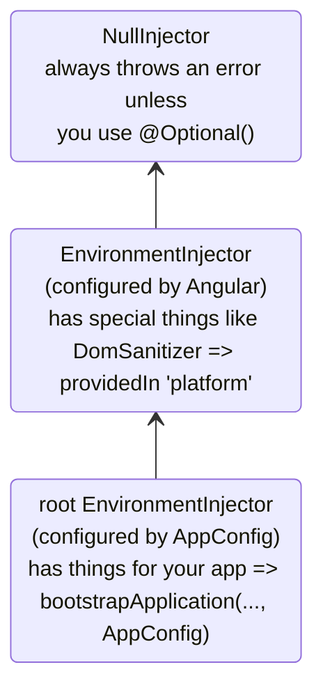
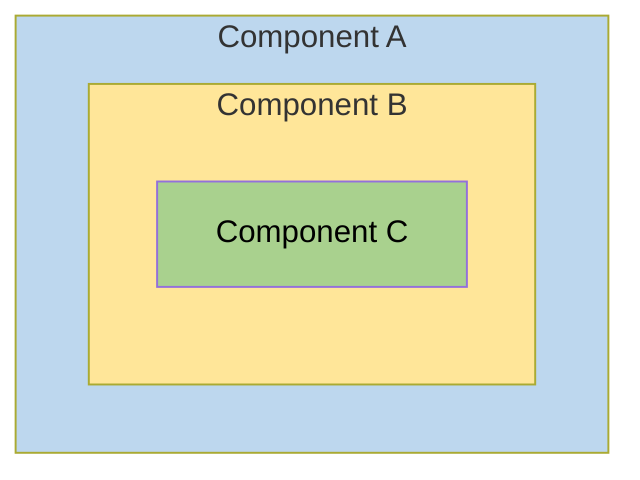
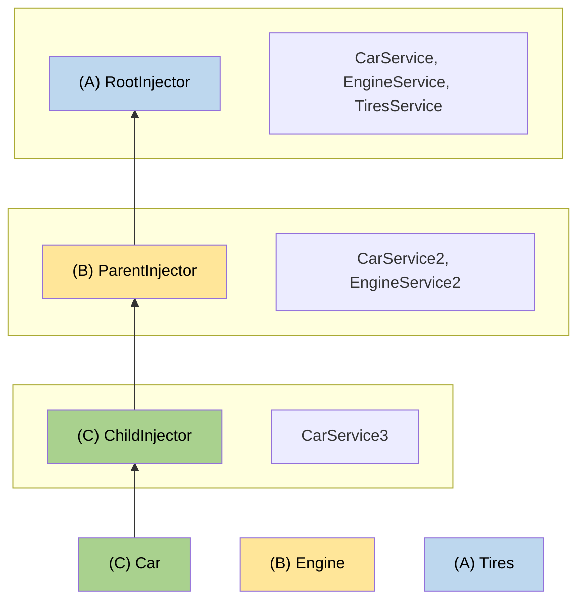

# Hierarchical injectorها

این راهنما dependency injection system سلسله‌مراتبی Angular را به‌صورت جامع پوشش می‌دهد، از جمله resolution ruleها، modifierها و patternهای پیشرفته.

NOTE: برای مفهوم‌های پایه درباره injector hierarchy و provider scoping، [راهنمای defining dependency providers](guide/di/defining-dependency-providers#injector-hierarchy-in-angular) را ببینید.

## نوع‌های injector hierarchy

Angular دو injector hierarchy دارد:

| Injector hierarchies            | Details                                                                                                                                                               |
| :------------------------------ | :-------------------------------------------------------------------------------------------------------------------------------------------------------------------- |
| hierarchy مربوط به `EnvironmentInjector` | یک `EnvironmentInjector` را در این hierarchy با `@Service()` یا array مربوط به `providers` در `ApplicationConfig` configure کنید.                                     |
| hierarchy مربوط به `ElementInjector`     | به‌صورت ضمنی روی هر DOM element ساخته می‌شود. یک `ElementInjector` به‌صورت پیش‌فرض خالی است، مگر اینکه آن را در property مربوط به `providers` روی `@Directive()` یا `@Component()` configure کنید. |

<docs-callout title="NgModule Based Applications">
برای applicationهای مبتنی بر `NgModule`، می‌توانید dependencyها را با hierarchy مربوط به `ModuleInjector` و با استفاده از annotationهای `@NgModule()` یا `@Injectable()` provide کنید.
</docs-callout>

### `EnvironmentInjector`

`EnvironmentInjector` را می‌توان به یکی از دو روش configure کرد:

- `@Service()`
- array مربوط به `ApplicationConfig` `providers`

<docs-callout title="Tree-shaking and @Service()">

استفاده از decorator مربوط به `@Service()` به استفاده از array مربوط به `ApplicationConfig` `providers` ترجیح داده می‌شود. با `@Service`، ابزارهای optimization می‌توانند tree-shaking انجام دهند و serviceهایی را که application شما استفاده نمی‌کند حذف کنند. نتیجه، bundle size کوچک‌تر است.

Tree-shaking به‌خصوص برای library مفید است، چون applicationی که از library استفاده می‌کند ممکن است نیازی به inject کردن آن نداشته باشد.

</docs-callout>

`EnvironmentInjector` توسط `ApplicationConfig.providers` configure می‌شود.

Serviceها را با `@Service()` به شکل زیر provide کنید:

```ts {highlight:[4]}
import {Service} from '@angular/core';

@Service() // <--provides this service in the root EnvironmentInjector
export class ItemService {
  name = 'telephone';
}
```

Decoratorهای `@Service()` یا `@Injectable()` یک service class را شناسایی می‌کنند.

### ModuleInjector

در applicationهای مبتنی بر `NgModule`، `ModuleInjector` را می‌توان به این روش‌ها configure کرد:

- decorator مربوط به `@Service()`
- property مربوط به `providedIn` در `@Injectable()` برای ارجاع به `root` یا `platform`
- array مربوط به `@NgModule()` `providers`

`ModuleInjector` با propertyهای `@NgModule.providers` و `NgModule.imports` configure می‌شود. `ModuleInjector` flatten شده همه arrayهای providers است که با دنبال کردن recursive مربوط به `NgModule.imports` قابل دسترسی هستند.

Child `ModuleInjector` hierarchyها هنگام lazy loading کردن `@NgModules` دیگر ساخته می‌شوند.

### Platform injector

بالای `root` دو injector دیگر وجود دارد: یک `EnvironmentInjector` اضافه و `NullInjector()`.

در نظر بگیرید Angular چگونه application را با مورد زیر در `main.ts` bootstrap می‌کند:

```ts
bootstrapApplication(App, appConfig);
```

Method مربوط به `bootstrapApplication()` یک child injector از platform injector می‌سازد که توسط instance مربوط به `ApplicationConfig` configure شده است.
این همان `root` `EnvironmentInjector` است.

Method مربوط به `platformBrowserDynamic()` یک injector می‌سازد که با `PlatformModule` configure شده و dependencyهای platform-specific را شامل می‌شود.
این اجازه می‌دهد چند application یک platform configuration را share کنند.
مثلا یک browser فقط یک URL bar دارد، مهم نیست چند application در حال اجرا داشته باشید.
می‌توانید providerهای platform-specific اضافه را در platform level با supply کردن `extraProviders` از طریق تابع `platformBrowser()` configure کنید.

Parent injector بعدی در hierarchy، `NullInjector()` است که بالاترین نقطه tree است.
اگر آن‌قدر در tree بالا رفته باشید که دنبال service در `NullInjector()` بگردید، error می‌گیرید مگر اینکه از `@Optional()` استفاده کرده باشید؛ چون در نهایت همه‌چیز به `NullInjector()` ختم می‌شود و آن error برمی‌گرداند، یا در مورد `@Optional()` مقدار `null`.
برای اطلاعات بیشتر درباره `@Optional()`، بخش [`@Optional()`](#optional) همین راهنما را ببینید.

نمودار زیر رابطه میان `root` `ModuleInjector` و parent injectorهای آن را همان‌طور که paragraphهای قبلی توضیح دادند نشان می‌دهد.



با اینکه نام `root` یک alias ویژه است، hierarchyهای دیگر `EnvironmentInjector` alias ندارند.
هر زمان componentی به‌صورت dynamic load می‌شود، مثل Router که child `EnvironmentInjector` hierarchy می‌سازد، می‌توانید `EnvironmentInjector` hierarchy بسازید.

همه requestها به root injector forward می‌شوند، چه آن را با instance مربوط به `ApplicationConfig` پاس‌داده‌شده به `bootstrapApplication()` configure کرده باشید، چه همه providerها را با `root` در serviceهای خودشان register کرده باشید.

<docs-callout title="@Injectable() vs. ApplicationConfig">

اگر یک app-wide provider را در `ApplicationConfig` مربوط به `bootstrapApplication` configure کنید، providerی را که در metadata مربوط به `@Injectable()` برای `root` configure شده override می‌کند.
می‌توانید از این برای configure کردن provider غیر پیش‌فرض برای serviceای استفاده کنید که با چند application shared است.

این نمونه‌ای از حالتی است که component router configuration شامل [location strategy](guide/routing/common-router-tasks#locationstrategy-and-browser-url-styles) غیر پیش‌فرض است و provider آن را در list مربوط به `providers` در `ApplicationConfig` قرار می‌دهد.

```ts
providers: [{provide: LocationStrategy, useClass: HashLocationStrategy}];
```

برای applicationهای مبتنی بر `NgModule`، app-wide providerها را در `providers` مربوط به `AppModule` configure کنید.

</docs-callout>

### `ElementInjector`

Angular برای هر DOM element به‌صورت ضمنی `ElementInjector` hierarchy می‌سازد.

Provide کردن یک service در decorator مربوط به `@Component()` با استفاده از propertyهای `providers` یا `viewProviders`، یک `ElementInjector` را configure می‌کند.
مثلا `TestComponent` زیر با provide کردن service، `ElementInjector` را configure می‌کند:

```ts {highlight:[3]}
@Component({
  /* … */
  providers: [{ provide: ItemService, useValue: { name: 'lamp' } }]
})
export class TestComponent
```

HELPFUL: برای درک رابطه میان tree مربوط به `EnvironmentInjector`، `ModuleInjector` و tree مربوط به `ElementInjector`، بخش [resolution rules](#resolution-rules) را ببینید.

وقتی serviceها را در یک component provide می‌کنید، آن service از طریق `ElementInjector` همان component instance در دسترس است.
بر اساس visibility ruleهایی که در بخش [resolution rules](#resolution-rules) توضیح داده شده، ممکن است برای component/directiveهای child هم visible باشد.

وقتی component instance destroy شود، آن service instance هم destroy می‌شود.

#### `@Directive()` و `@Component()`

Component نوع ویژه‌ای از directive است؛ یعنی همان‌طور که `@Directive()` property مربوط به `providers` دارد، `@Component()` هم دارد.
یعنی directiveها و componentها هر دو می‌توانند با property مربوط به `providers` providerها را configure کنند.
وقتی با property مربوط به `providers` یک provider را برای component یا directive configure می‌کنید، آن provider به `ElementInjector` همان component یا directive تعلق دارد.
Componentها و directiveهایی که روی یک element هستند یک injector را share می‌کنند.

## Resolution ruleها

وقتی Angular یک token را برای component/directive resolve می‌کند، این کار را در دو phase انجام می‌دهد:

1. در برابر parentهای آن در hierarchy مربوط به `ElementInjector`.
2. در برابر parentهای آن در hierarchy مربوط به `EnvironmentInjector`.

وقتی یک component dependencyای declare می‌کند، Angular تلاش می‌کند آن dependency را با `ElementInjector` خود component satisfy کند.
اگر injector مربوط به component provider را نداشته باشد، request را به `ElementInjector` مربوط به parent component پاس می‌دهد.

Requestها همین‌طور به بالا forward می‌شوند تا Angular injectorی پیدا کند که بتواند request را handle کند یا همه ancestor `ElementInjector` hierarchyها تمام شوند.

اگر Angular provider را در هیچ `ElementInjector` hierarchy پیدا نکند، به elementی که request از آن شروع شده برمی‌گردد و در hierarchy مربوط به `EnvironmentInjector` جست‌وجو می‌کند.
اگر Angular همچنان provider را پیدا نکند، error throw می‌کند.

اگر برای یک DI token یکسان در levelهای مختلف provider register کرده باشید، اولین موردی که Angular encounter می‌کند برای resolve کردن dependency استفاده می‌شود.
مثلا اگر provider به‌صورت local در componentی register شده باشد که به service نیاز دارد، Angular دنبال provider دیگری برای همان service نمی‌گردد.

HELPFUL: برای applicationهای مبتنی بر `NgModule`، اگر Angular نتواند provider را در `ElementInjector` hierarchyها پیدا کند، hierarchy مربوط به `ModuleInjector` را search می‌کند.

## Resolution modifierها

Resolution behavior در Angular را می‌توان با `optional`، `self`، `skipSelf` و `host` تغییر داد.
هرکدام را از `@angular/core` import کنید و هنگام inject کردن service، هرکدام را در configuration مربوط به [`inject`](/api/core/inject) استفاده کنید.

### نوع‌های modifier

Resolution modifierها در سه دسته قرار می‌گیرند:

- اگر Angular چیزی را که دنبال آن هستید پیدا نکرد چه کند؛ یعنی `optional`
- از کجا شروع به جست‌وجو کند؛ یعنی `skipSelf`
- کجا جست‌وجو را متوقف کند؛ یعنی `host` و `self`

به‌صورت پیش‌فرض، Angular همیشه از `Injector` فعلی شروع می‌کند و تا بالا search را ادامه می‌دهد.
Modifierها اجازه می‌دهند location شروع، یا _self_، و location پایان را تغییر دهید.

همچنین می‌توانید همه modifierها را با هم ترکیب کنید، به‌جز:

- `host` و `self`
- `skipSelf` و `self`.

### `optional`

`optional` به Angular اجازه می‌دهد serviceای را که inject می‌کنید optional در نظر بگیرد.
به این شکل، اگر در runtime قابل resolve نباشد، Angular به‌جای throw کردن error، service را به‌صورت `null` resolve می‌کند.
در مثال زیر، service به نام `OptionalService` در service، `ApplicationConfig`، `@NgModule()` یا component class provide نشده است، پس هیچ جای app در دسترس نیست.

```ts {header:"src/app/optional/optional.ts"}
export class Optional {
  public optional? = inject(OptionalService, {optional: true});
}
```

### `self`

از `self` استفاده کنید تا Angular فقط در `ElementInjector` مربوط به component یا directive فعلی جست‌وجو کند.

یک use case خوب برای `self` این است که serviceای را inject کنید فقط اگر روی host element فعلی در دسترس باشد.
برای جلوگیری از error در این وضعیت، `self` را با `optional` ترکیب کنید.

برای مثال، در `SelfNoData` زیر به `LeafService` inject شده به‌عنوان property توجه کنید.

```ts {header: 'self-no-data.ts', highlight: [7]}
@Component({
  selector: 'app-self-no-data',
  templateUrl: './self-no-data.html',
  styleUrls: ['./self-no-data.css'],
})
export class SelfNoData {
  public leaf = inject(LeafService, {optional: true, self: true});
}
```

در این مثال parent provider وجود دارد و inject کردن service مقدار را برمی‌گرداند؛ اما inject کردن service با `self` و `optional` مقدار `null` برمی‌گرداند، چون `self` به injector می‌گوید search را در host element فعلی متوقف کند.

مثال دیگر component classای را با provider برای `FlowerService` نشان می‌دهد.
در این حالت injector جلوتر از `ElementInjector` فعلی نمی‌رود، چون `FlowerService` را پیدا می‌کند و tulip <code>🌷</code> را برمی‌گرداند.

```ts {header:"src/app/self/self.ts"}
@Component({
  selector: 'app-self',
  templateUrl: './self.html',
  styleUrls: ['./self.css'],
  providers: [{provide: FlowerService, useValue: {emoji: '🌷'}}],
})
export class Self {
  public flower = inject(FlowerService, {self: true});
}
```

### `skipSelf`

`skipSelf` برعکس `self` است.
با `skipSelf`، Angular جست‌وجو برای service را به‌جای injector فعلی، از parent `ElementInjector` شروع می‌کند.
بنابراین اگر parent `ElementInjector` مقدار fern <code>🌿</code> را برای `emoji` استفاده کند، اما در array مربوط به `providers` در component مقدار maple leaf <code>🍁</code> داشته باشید، Angular مقدار maple leaf <code>🍁</code> را نادیده می‌گیرد و از fern <code>🌿</code> استفاده می‌کند.

برای دیدن این در کد، فرض کنید مقدار زیر برای `emoji` همان چیزی است که parent component استفاده می‌کند:

```ts {header: 'leaf.service.ts'}
export class LeafService {
  emoji = '🌿';
}
```

تصور کنید در child component مقدار متفاوتی، maple leaf 🍁، دارید اما می‌خواهید از مقدار parent استفاده کنید.
اینجاست که از `skipSelf` استفاده می‌کنید:

```ts {header:"skipself.ts" highlight:[[6],[10]]}
@Component({
  selector: 'app-skipself',
  templateUrl: './skipself.html',
  styleUrls: ['./skipself.css'],
  // Angular would ignore this LeafService instance
  providers: [{provide: LeafService, useValue: {emoji: '🍁'}}],
})
export class Skipself {
  // Use skipSelf as inject option
  public leaf = inject(LeafService, {skipSelf: true});
}
```

در این حالت، مقدار `emoji` که می‌گیرید fern <code>🌿</code> است، نه maple leaf <code>🍁</code>.

#### Option مربوط به `skipSelf` همراه با `optional`

از option مربوط به `skipSelf` همراه با `optional` استفاده کنید تا اگر value برابر `null` بود error رخ ندهد.

در مثال زیر، service مربوط به `Person` هنگام property initialization inject می‌شود.
`skipSelf` به Angular می‌گوید injector فعلی را skip کند و `optional` اگر service مربوط به `Person` برابر `null` باشد از error جلوگیری می‌کند.

```ts
class Person {
  parent = inject(Person, {optional: true, skipSelf: true});
}
```

### `host`

<!-- TODO: Remove ambiguity between host and self. -->

`host` اجازه می‌دهد یک component را هنگام search برای providerها، به‌عنوان آخرین stop در injector tree تعیین کنید.

حتی اگر service instanceای بالاتر در tree وجود داشته باشد، Angular جست‌وجو را ادامه نمی‌دهد.
از `host` به شکل زیر استفاده کنید:

```ts {header:"host.ts" highlight:[[6],[9]]}
@Component({
  selector: 'app-host',
  templateUrl: './host.html',
  styleUrls: ['./host.css'],
  // provide the service
  providers: [{provide: FlowerService, useValue: {emoji: '🌷'}}],
})
export class Host {
  // use host when injecting the service
  flower = inject(FlowerService, {host: true, optional: true});
}
```

چون `Host` option مربوط به `host` را دارد، مهم نیست parent مربوط به `Host` چه مقدار `flower.emoji` داشته باشد؛ `Host` از tulip <code>🌷</code> استفاده می‌کند.

### Modifierها با constructor injection

مشابه آنچه قبل‌تر گفته شد، behavior مربوط به constructor injection را می‌توان با `@Optional()`، `@Self()`، `@SkipSelf()` و `@Host()` تغییر داد.

هرکدام را از `@angular/core` import کنید و هنگام inject کردن service در constructor مربوط به component class استفاده کنید.

```ts {header:"self-no-data.ts" highlight:[2]}
export class SelfNoData {
  constructor(@Self() @Optional() public leaf?: LeafService) {}
}
```

## ساختار logical مربوط به template

وقتی serviceها را در component class provide می‌کنید، serviceها در tree مربوط به `ElementInjector` بر اساس اینکه کجا و چگونه آن‌ها را provide کرده‌اید visible هستند.

درک ساختار logical زیرین template در Angular، پایه‌ای برای configure کردن serviceها به شما می‌دهد و در نتیجه visibility آن‌ها را کنترل می‌کند.

Componentها در templateهای شما استفاده می‌شوند، مثل مثال زیر:

```html
<app-root> <app-child />; </app-root>
```

HELPFUL: معمولا componentها و templateهای آن‌ها را در فایل‌های جداگانه declare می‌کنید.
برای درک نحوه کار injection system، مفید است از دید یک logical tree ترکیب‌شده به آن‌ها نگاه کنید.
اصطلاح _logical_ آن را از render tree متمایز می‌کند، یعنی DOM tree application شما.
برای علامت‌گذاری locationهایی که templateهای component در آن‌ها قرار دارند، این راهنما از pseudo-element مربوط به `<#VIEW>` استفاده می‌کند؛ این element واقعا در render tree وجود ندارد و فقط برای model ذهنی است.

مثال زیر نشان می‌دهد view treeهای `<app-root>` و `<app-child>` چگونه در یک logical tree واحد ترکیب می‌شوند:

```html
<app-root>
  <#VIEW>
    <app-child>
     <#VIEW>
       …content goes here…
     </#VIEW>
    </app-child>
  </#VIEW>
</app-root>
```

درک مرزبندی `<#VIEW>` هنگام configure کردن serviceها در component class به‌خصوص مهم است.

## مثال: Provide کردن serviceها در `@Component()`

اینکه serviceها را با decorator مربوط به `@Component()` یا `@Directive()` چگونه provide می‌کنید visibility آن‌ها را تعیین می‌کند.
بخش‌های زیر `providers` و `viewProviders` را همراه با روش‌هایی برای تغییر service visibility با `skipSelf` و `host` نشان می‌دهند.

یک component class می‌تواند serviceها را به دو روش provide کند:

| Arrays                       | Details                                        |
| :--------------------------- | :--------------------------------------------- |
| با array مربوط به `providers`     | `@Component({ providers: [SomeService] })`     |
| با array مربوط به `viewProviders` | `@Component({ viewProviders: [SomeService] })` |

در مثال‌های پایین، logical tree یک Angular application را خواهید دید.
برای نشان دادن اینکه injector در context templateها چگونه کار می‌کند، logical tree ساختار HTML application را نمایش می‌دهد.
مثلا logical tree نشان می‌دهد `<child-component>` child مستقیم `<parent-component>` است.

در logical tree، attributeهای ویژه‌ای می‌بینید: `@Provide`، `@Inject` و `@ApplicationConfig`.
این‌ها attribute واقعی نیستند و فقط برای نمایش آنچه زیر hood اتفاق می‌افتد آمده‌اند.

| Angular service attribute | Details                                                                                         |
| :------------------------ | :---------------------------------------------------------------------------------------------- |
| `@Inject(Token)=>Value`   | اگر `Token` در این location از logical tree inject شود، value آن `Value` خواهد بود.             |
| `@Provide(Token=Value)`   | نشان می‌دهد `Token` با `Value` در این location از logical tree provide شده است.                 |
| `@ApplicationConfig`      | نشان می‌دهد fallback مربوط به `EnvironmentInjector` باید در این location استفاده شود.           |

### ساختار app نمونه

Application نمونه یک `FlowerService` دارد که در `root` provide شده و مقدار `emoji` آن red hibiscus <code>🌺</code> است.

```ts {header:"flower.service.ts"}
@Service()
export class FlowerService {
  emoji = '🌺';
}
```

Applicationی را در نظر بگیرید که فقط یک `App` و یک `Child` دارد.
ساده‌ترین rendered view شبیه HTML elementهای nested زیر است:

```html
<app-root>
  <!-- App selector -->
  <app-child> <!-- Child selector --> </app-child>
</app-root>
```

اما پشت صحنه، Angular هنگام resolve کردن injection requestها از representation منطقی view به شکل زیر استفاده می‌کند:

```html
<app-root> <!-- App selector -->
  <#VIEW>
    <app-child> <!-- Child selector -->
      <#VIEW>
      </#VIEW>
    </app-child>
  </#VIEW>
</app-root>
```

`<#VIEW>` در اینجا نماینده یک instance از template است.
توجه کنید هر component، `<#VIEW>` خودش را دارد.

دانستن این ساختار کمک می‌کند serviceهای خود را provide و inject کنید و کنترل کامل visibility service را داشته باشید.

حالا در نظر بگیرید `<app-root>`، `FlowerService` را inject می‌کند:

```typescript
export class App {
  flower = inject(FlowerService);
}
```

برای visualize کردن نتیجه، یک binding به template مربوط به `<app-root>` اضافه کنید:

```html
<p>Emoji from FlowerService: {{flower.emoji}}</p>
```

خروجی در view چنین خواهد بود:

```text {hideCopy}
Emoji from FlowerService: 🌺
```

در logical tree، این به شکل زیر نمایش داده می‌شود:

```html
<app-root @ApplicationConfig
        @Inject(FlowerService) flower=>"🌺">
  <#VIEW>
    <p>Emoji from FlowerService: {{flower.emoji}} (🌺)</p>
    <app-child>
      <#VIEW>
      </#VIEW>
    </app-child>
  </#VIEW>
</app-root>
```

وقتی `<app-root>`، `FlowerService` را request می‌کند، کار injector resolve کردن token مربوط به `FlowerService` است.
Resolution مربوط به token در دو phase رخ می‌دهد:

1. Injector location شروع در logical tree و location پایان search را تعیین می‌کند.
   Injector از location شروع شروع می‌کند و در هر view level در logical tree دنبال token می‌گردد.
   اگر token پیدا شود، برگردانده می‌شود.

1. اگر token پیدا نشود، injector نزدیک‌ترین parent `EnvironmentInjector` را پیدا می‌کند تا request را به آن delegate کند.

در این مثال، constraintها چنین هستند:

1. با `<#VIEW>` متعلق به `<app-root>` شروع کنید و با `<app-root>` پایان دهید.
   - معمولا نقطه شروع search همان point of injection است.
     اما در این حالت `<app-root>` یک component است. `@Component`ها ویژه‌اند، چون `viewProviders` خودشان را هم include می‌کنند؛ به همین دلیل search از `<#VIEW>` متعلق به `<app-root>` شروع می‌شود.
     این برای directiveای که در همان location match شده باشد صدق نمی‌کند.
   - location پایان همان خود component است، چون بالاترین component در این application است.

1. `EnvironmentInjector` فراهم‌شده توسط `ApplicationConfig` به‌عنوان fallback injector عمل می‌کند وقتی injection token در `ElementInjector` hierarchyها پیدا نشود.

### استفاده از array مربوط به `providers`

حالا در class مربوط به `Child`، یک provider برای `FlowerService` اضافه کنید تا resolution ruleهای پیچیده‌تر را در بخش‌های بعدی نشان دهیم:

```ts
@Component({
  selector: 'app-child',
  templateUrl: './child.html',
  styleUrls: ['./child.css'],
  // use the providers array to provide a service
  providers: [{provide: FlowerService, useValue: {emoji: '🌻'}}],
})
export class Child {
  // inject the service
  flower = inject(FlowerService);
}
```

حالا که `FlowerService` در decorator مربوط به `@Component()` provide شده، وقتی `<app-child>` service را request کند، injector فقط لازم است تا `ElementInjector` مربوط به `<app-child>` نگاه کند.
نیازی ندارد search را در injector tree بیشتر ادامه دهد.

Step بعدی اضافه کردن binding به template مربوط به `Child` است.

```html
<p>Emoji from FlowerService: {{flower.emoji}}</p>
```

برای render کردن valueهای جدید، `<app-child>` را به پایین template مربوط به `App` اضافه کنید تا view مقدار sunflower را هم نمایش دهد:

```text {hideCopy}
Child Component
Emoji from FlowerService: 🌻
```

در logical tree، این به شکل زیر نمایش داده می‌شود:

```html
<app-root @ApplicationConfig
          @Inject(FlowerService) flower=>"🌺">
  <#VIEW>

  <p>Emoji from FlowerService: {{flower.emoji}} (🌺)</p>
  <app-child @Provide(FlowerService="🌻" )
             @Inject(FlowerService)=>"🌻"> <!-- search ends here -->
    <#VIEW> <!-- search starts here -->
    <h2>Child Component</h2>
    <p>Emoji from FlowerService: {{flower.emoji}} (🌻)</p>
  </
  #VIEW>
  </app-child>
</#VIEW>
</app-root>
```

وقتی `<app-child>`، `FlowerService` را request می‌کند، injector search را از `<#VIEW>` متعلق به `<app-child>` شروع می‌کند \(`<#VIEW>` include می‌شود چون injection از `@Component()` انجام شده\) و با `<app-child>` پایان می‌دهد.
در این حالت، `FlowerService` در array مربوط به `providers` با مقدار sunflower <code>🌻</code> مربوط به `<app-child>` resolve می‌شود.
Injector لازم نیست جای دیگری در injector tree بگردد.
به‌محض پیدا کردن `FlowerService` متوقف می‌شود و هرگز red hibiscus <code>🌺</code> را نمی‌بیند.

### استفاده از array مربوط به `viewProviders`

از array مربوط به `viewProviders` به‌عنوان راه دیگری برای provide کردن serviceها در decorator مربوط به `@Component()` استفاده کنید.
استفاده از `viewProviders` serviceها را در `<#VIEW>` visible می‌کند.

HELPFUL: Stepها همان stepهای استفاده از array مربوط به `providers` هستند، با این تفاوت که از array مربوط به `viewProviders` استفاده می‌کنید.

برای دستورالعمل مرحله‌به‌مرحله، این بخش را ادامه دهید.
اگر خودتان می‌توانید setup کنید، به [Modifying service availability](#visibility-of-provided-tokens) بروید.

برای demonstration، یک `AnimalService` می‌سازیم تا `viewProviders` را نشان دهد.
اول، یک `AnimalService` با property به نام `emoji` و مقدار whale <code>🐳</code> بسازید:

```typescript
import {Service} from '@angular/core';

@Service()
export class AnimalService {
  emoji = '🐳';
}
```

با همان pattern مربوط به `FlowerService`، `AnimalService` را در class مربوط به `App` inject کنید:

```ts
export class App {
  public flower = inject(FlowerService);
  public animal = inject(AnimalService);
}
```

HELPFUL: می‌توانید همه codeهای مربوط به `FlowerService` را سر جای خود نگه دارید، چون امکان comparison با `AnimalService` را می‌دهد.

یک array مربوط به `viewProviders` اضافه کنید و `AnimalService` را در class مربوط به `<app-child>` هم inject کنید، اما به `emoji` مقدار متفاوت بدهید.
اینجا مقدار آن dog 🐶 است.

```typescript
@Component({
  selector: 'app-child',
  templateUrl: './child.html',
  styleUrls: ['./child.css'],
  // provide services
  providers: [{provide: FlowerService, useValue: {emoji: '🌻'}}],
  viewProviders: [{provide: AnimalService, useValue: {emoji: '🐶'}}],
})
export class Child {
  // inject services
  flower = inject(FlowerService);
  animal = inject(AnimalService);
}
```

Bindingها را به templateهای `Child` و `App` اضافه کنید.
در template مربوط به `Child`، binding زیر را اضافه کنید:

```html
<p>Emoji from AnimalService: {{animal.emoji}}</p>
```

همچنین همان را به template مربوط به `App` اضافه کنید:

```html
<p>Emoji from AnimalService: {{animal.emoji}}</p>
```

حالا باید هر دو value را در browser ببینید:

```text {hideCopy}
App
Emoji from AnimalService: 🐳

Child Component
Emoji from AnimalService: 🐶
```

Logical tree برای این مثال `viewProviders` چنین است:

```html
<app-root @ApplicationConfig
          @Inject(AnimalService) animal=>"🐳">
  <#VIEW>
  <app-child>
    <#VIEW @Provide(AnimalService="🐶")
    @Inject(AnimalService=>"🐶")>

    <!-- ^^using viewProviders means AnimalService is available in <#VIEW>-->
    <p>Emoji from AnimalService: {{animal.emoji}} (🐶)</p>
  </
  #VIEW>
  </app-child>
</#VIEW>
</app-root>
```

درست مثل مثال `FlowerService`، `AnimalService` در decorator مربوط به `@Component()` در `<app-child>` provide شده است.
یعنی چون injector اول در `ElementInjector` مربوط به component نگاه می‌کند، مقدار dog <code>🐶</code> مربوط به `AnimalService` را پیدا می‌کند.
نیازی ندارد search را در `ElementInjector` tree یا `ModuleInjector` ادامه دهد.

### `providers` در برابر `viewProviders`

Field مربوط به `viewProviders` از نظر مفهومی شبیه `providers` است، اما یک تفاوت مهم دارد.
Providerهای داخل `viewProviders` فقط داخل view خود component visible هستند؛ contentی که از طریق `<ng-content>` داخل component project می‌شود نمی‌تواند آن‌ها را ببیند.

برای دیدن تفاوت میان `providers` و `viewProviders`، component دیگری به مثال اضافه کنید و آن را `Inspector` بنامید.
`Inspector` child مربوط به `Child` خواهد بود.
در `inspector.ts`، هنگام property initialization، `FlowerService` و `AnimalService` را inject کنید:

```typescript
export class Inspector {
  flower = inject(FlowerService);
  animal = inject(AnimalService);
}
```

به array مربوط به `providers` یا `viewProviders` نیاز ندارید.
بعد، در `inspector.html` همان markup مربوط به componentهای قبلی را اضافه کنید:

```html
<p>Emoji from FlowerService: {{flower.emoji}}</p>
<p>Emoji from AnimalService: {{animal.emoji}}</p>
```

یادتان باشد `Inspector` را به array مربوط به `imports` در `Child` اضافه کنید.

```ts
@Component({
  ...
  imports: [Inspector]
})
```

بعد، مورد زیر را به `child.html` اضافه کنید:

```html
...

<div class="container">
  <h3>Content projection</h3>
  <ng-content />
</div>
<h3>Inside the view</h3>

<app-inspector />
```

`<ng-content>` اجازه می‌دهد content را project کنید، و `<app-inspector>` داخل template مربوط به `Child` باعث می‌شود `Inspector` child component مربوط به `Child` باشد.

بعد، برای استفاده از content projection، مورد زیر را به `app.html` اضافه کنید.

```html
<app-child>
  <app-inspector />
</app-child>
```

اکنون browser خروجی زیر را render می‌کند، با حذف مثال‌های قبلی برای کوتاهی:

```text {hideCopy}
...
Content projection

Emoji from FlowerService: 🌻
Emoji from AnimalService: 🐳

Emoji from FlowerService: 🌻
Emoji from AnimalService: 🐶
```

این چهار binding تفاوت میان `providers` و `viewProviders` را نشان می‌دهند.
به یاد داشته باشید emoji مربوط به dog <code>🐶</code> داخل `<#VIEW>` مربوط به `Child` declare شده و برای projected content visible نیست.
در عوض، projected content مقدار whale <code>🐳</code> را می‌بیند.

ممکن است بپرسید چرا `<app-inspector>` project شده همچنان می‌تواند <code>🐳</code> مربوط به `viewProviders` در `App` را ببیند.
دلیلش این است که DI در Angular track می‌کند **component کجا declare شده است**، نه اینکه نهایتا کجا render می‌شود.
`<app-inspector>` در template مربوط به `App` زندگی می‌کند، داخل `<#VIEW>` مربوط به `App`؛ بنابراین `viewProviders` مربوط به `App` برایش قابل دسترسی است.
Project کردن آن داخل `Child` دسترسی به `viewProviders` مربوط به `Child` یعنی <code>🐶</code> را قطع می‌کند، اما providerهای `App` یعنی <code>🐳</code> همچنان در بالای tree reachable هستند.

اما در بخش خروجی بعدی، `Inspector` یک child component واقعی از `Child` است و داخل `<#VIEW>` قرار دارد؛ بنابراین وقتی `AnimalService` را request می‌کند، dog <code>🐶</code> را می‌بیند.

`AnimalService` در logical tree چنین خواهد بود:

```html
<app-root @ApplicationConfig
          @Inject(AnimalService) animal=>"🐳">
  <#VIEW>
  <app-child>
    <#VIEW @Provide(AnimalService="🐶")
    @Inject(AnimalService=>"🐶")>

    <!-- ^^using viewProviders means AnimalService is available in <#VIEW>-->
    <p>Emoji from AnimalService: {{animal.emoji}} (🐶)</p>

    <div class="container">
      <h3>Content projection</h3>
      <app-inspector @Inject(AnimalService) animal=>"🐳">
        <p>Emoji from AnimalService: {{animal.emoji}} (🐳)</p>
      </app-inspector>
    </div>

    <app-inspector>
      <#VIEW @Inject(AnimalService) animal=>"🐶">
      <p>Emoji from AnimalService: {{animal.emoji}} (🐶)</p>
    </
    #VIEW>
    </app-inspector>
  </
  #VIEW>
  </app-child>

</#VIEW>
</app-root>
```

`<app-inspector>` project شده مقدار <code>🐳</code> را می‌گیرد، چون <code>🐶</code> متعلق به view مربوط به `Child` است و projected content نمی‌تواند به آن برسد.
<code>🐳</code> در دسترس است چون `<app-inspector>` در template مربوط به `App` declare شده و همچنان می‌تواند به `viewProviders` مربوط به `App` در بالای tree برسد.

`<app-inspector>` که مستقیم داخل template مربوط به `Child` قرار دارد، یعنی project نشده، مقدار <code>🐶</code> را می‌گیرد؛ چون داخل `<#VIEW>` است و مرزی برای عبور وجود ندارد.

### Visibility مربوط به tokenهای provide شده

Visibility decoratorها روی اینکه search برای injection token در logical tree از کجا شروع و کجا تمام می‌شود اثر می‌گذارند.
برای این کار، visibility configuration را در نقطه injection، یعنی هنگام invoke کردن `inject()`، قرار دهید نه در نقطه declaration.

برای تغییر جایی که injector search برای `FlowerService` را شروع می‌کند، `skipSelf` را به invocation مربوط به `inject()` در `<app-child>` اضافه کنید، همان‌جا که `FlowerService` inject شده است.
این invocation یک property initializer در `<app-child>` است، همان‌طور که در `child.ts` نشان داده شده:

```typescript
flower = inject(FlowerService, {skipSelf: true});
```

با `skipSelf`، injector مربوط به `<app-child>` برای `FlowerService` به خودش نگاه نمی‌کند.
در عوض، injector جست‌وجو برای `FlowerService` را از `ElementInjector` مربوط به `<app-root>` شروع می‌کند، جایی که چیزی پیدا نمی‌کند.
سپس به `ModuleInjector` مربوط به `<app-child>` برمی‌گردد و مقدار red hibiscus <code>🌺</code> را پیدا می‌کند؛ این مقدار در دسترس است چون `<app-child>` و `<app-root>` همان `ModuleInjector` را share می‌کنند.
UI خروجی زیر را render می‌کند:

```text {hideCopy}
Emoji from FlowerService: 🌺
```

در logical tree، همین ایده می‌تواند شبیه این باشد:

```html
<app-root @ApplicationConfig
          @Inject(FlowerService) flower=>"🌺">
  <#VIEW>
  <app-child @Provide(FlowerService="🌻" )>
    <#VIEW @Inject(FlowerService, SkipSelf)=>"🌺">

    <!-- With SkipSelf, the injector looks to the next injector up the tree (app-root) -->

  </
  #VIEW>
  </app-child>
</#VIEW>
</app-root>
```

با اینکه `<app-child>` مقدار sunflower <code>🌻</code> را provide می‌کند، application مقدار red hibiscus <code>🌺</code> را render می‌کند چون `skipSelf` باعث می‌شود injector فعلی یعنی `app-child` خودش را skip کند و به parent نگاه کند.

اگر حالا `host` را هم علاوه بر `skipSelf` اضافه کنید، نتیجه `null` می‌شود.
دلیلش این است که `host` upper bound مربوط به search را به `<#VIEW>` مربوط به `app-child` محدود می‌کند.
ایده در logical tree چنین است:

```html
<app-root @ApplicationConfig
          @Inject(FlowerService) flower=>"🌺">
  <#VIEW> <!-- end search here with null-->
  <app-child @Provide(FlowerService="🌻" )> <!-- start search here -->
    <#VIEW inject(FlowerService, {skipSelf: true, host: true, optional:true})=>null>
  </
  #VIEW>
  </app-parent>
</#VIEW>
</app-root>
```

اینجا serviceها و valueهایشان همان قبلی هستند، اما `host` مانع می‌شود injector برای `FlowerService` از `<#VIEW>` جلوتر برود؛ بنابراین آن را پیدا نمی‌کند و `null` برمی‌گرداند.

### `skipSelf` و `viewProviders`

به یاد داشته باشید `<app-child>`، `AnimalService` را در array مربوط به `viewProviders` با مقدار dog <code>🐶</code> provide می‌کند.
چون injector فقط لازم است در `ElementInjector` مربوط به `<app-child>` برای `AnimalService` نگاه کند، هرگز whale <code>🐳</code> را نمی‌بیند.

مثل مثال `FlowerService`، اگر `skipSelf` را به `inject()` مربوط به `AnimalService` اضافه کنید، injector برای `AnimalService` در `ElementInjector` مربوط به `<app-child>` فعلی نگاه نمی‌کند.
در عوض، injector از `ElementInjector` مربوط به `<app-root>` شروع می‌کند.

```typescript
@Component({
  selector: 'app-child',
  …
  viewProviders: [
    { provide: AnimalService, useValue: { emoji: '🐶' } },
  ],
})
```

Logical tree با `skipSelf` در `<app-child>` چنین است:

```html
<app-root @ApplicationConfig
          @Inject(AnimalService=>"🐳")>
  <#VIEW><!-- search begins here -->
  <app-child>
    <#VIEW @Provide(AnimalService="🐶")
    @Inject(AnimalService, SkipSelf=>"🐳")>

    <!--Add skipSelf -->

  </
  #VIEW>
  </app-child>
</#VIEW>
</app-root>
```

با `skipSelf` در `<app-child>`، injector search برای `AnimalService` را از `ElementInjector` مربوط به `<app-root>` شروع می‌کند و whale 🐳 را پیدا می‌کند.

### `host` و `viewProviders`

اگر فقط از `host` برای injection مربوط به `AnimalService` استفاده کنید، نتیجه dog <code>🐶</code> است، چون injector خود `AnimalService` را در `<#VIEW>` مربوط به `<app-child>` پیدا می‌کند.
`Child`، `viewProviders` را طوری configure می‌کند که emoji مربوط به dog به‌عنوان value مربوط به `AnimalService` provide شود.
می‌توانید `host` را در `inject()` هم ببینید:

```typescript
@Component({
  selector: 'app-child',
  …
  viewProviders: [
    { provide: AnimalService, useValue: { emoji: '🐶' } },
  ]
})
export class Child {
  animal = inject(AnimalService, { host: true })
}
```

`host: true` باعث می‌شود injector تا زمانی بگردد که به edge مربوط به `<#VIEW>` برسد.

```html
<app-root @ApplicationConfig
          @Inject(AnimalService=>"🐳")>
  <#VIEW>
  <app-child>
    <#VIEW @Provide(AnimalService="🐶")
    inject(AnimalService, {host: true}=>"🐶")> <!-- host stops search here -->
  </
  #VIEW>
  </app-child>
</#VIEW>
</app-root>
```

یک array مربوط به `viewProviders` با animal سوم، hedgehog <code>🦔</code>، به metadata مربوط به `@Component()` در `app.ts` اضافه کنید:

```typescript
@Component({
  selector: 'app-root',
  templateUrl: './app.html',
  styleUrls: [ './app.css' ],
  viewProviders: [
    { provide: AnimalService, useValue: { emoji: '🦔' } },
  ],
})
```

بعد، `skipSelf` را همراه با `host` به `inject()` مربوط به injection `AnimalService` در `child.ts` اضافه کنید.
اینجا `host` و `skipSelf` در initialization مربوط به property به نام `animal` آمده‌اند:

```typescript
export class Child {
  animal = inject(AnimalService, {host: true, skipSelf: true});
}
```

<!-- TODO: This requires a rework. It seems not well explained what `viewProviders`/`injectors` is here
  and how `host` works.
 -->

وقتی `host` و `skipSelf` روی `FlowerService` اعمال شدند، که در array مربوط به `providers` قرار دارد، نتیجه `null` بود؛ چون `skipSelf` search را از injector مربوط به `<app-child>` شروع می‌کند، اما `host` search را در `<#VIEW>` متوقف می‌کند، جایی که `FlowerService` وجود ندارد.
در logical tree می‌بینید که `FlowerService` در `<app-child>` visible است، نه در `<#VIEW>` آن.

اما `AnimalService` که در array مربوط به `viewProviders` در `App` provide شده visible است.

نمایش logical tree نشان می‌دهد چرا:

```html
<app-root @ApplicationConfig
          @Inject(AnimalService=>"🐳")>
  <#VIEW @Provide(AnimalService="🦔")
  @Inject(AnimalService, @Optional)=>"🦔">

  <!-- ^^skipSelf starts here,  host stops here^^ -->
  <app-child>
    <#VIEW @Provide(AnimalService="🐶")
    inject(AnimalService, {skipSelf:true, host: true, optional: true})=>"🦔">
    <!-- Add skipSelf ^^-->
  </
  #VIEW>
  </app-child>
</#VIEW>
</app-root>
```

`skipSelf` باعث می‌شود injector search برای `AnimalService` را از `<app-root>` شروع کند، نه از `<app-child>` که request از آن آمده، و `host` search را در `<#VIEW>` مربوط به `<app-root>` متوقف می‌کند.
چون `AnimalService` از طریق array مربوط به `viewProviders` provide شده، injector hedgehog <code>🦔</code> را در `<#VIEW>` پیدا می‌کند.

## مثال: use caseهای `ElementInjector`

توانایی configure کردن یک یا چند provider در levelهای مختلف، امکان‌های مفیدی باز می‌کند.

### Scenario: service isolation

دلایل معماری ممکن است باعث شوند access به یک service را به application domainی که به آن تعلق دارد محدود کنید.
مثلا فرض کنید یک `VillainsList` می‌سازیم که listی از villainها را نمایش می‌دهد.
این list، villainها را از `VillainsService` می‌گیرد.

اگر `VillainsService` را در root `AppModule` provide کنید، `VillainsService` در همه جای application visible می‌شود.
اگر بعدا `VillainsService` را modify کنید، ممکن است چیزی را در componentهای دیگر خراب کنید که تصادفا شروع به وابستگی به این service کرده‌اند.

در عوض، باید `VillainsService` را در metadata مربوط به `providers` در `VillainsList` به این شکل provide کنید:

```typescript
@Component({
  selector: 'app-villains-list',
  templateUrl: './villains-list.html',
  providers: [VillainsService],
})
export class VillainsList {}
```

با provide کردن `VillainsService` در metadata مربوط به `VillainsList` و هیچ جای دیگر، service فقط در `VillainsList` و subcomponent tree آن در دسترس می‌شود.

`VillainsService` نسبت به `VillainsList` یک singleton است، چون همان‌جا declare شده است.
تا وقتی `VillainsList` destroy نشود، همان instance از `VillainsService` باقی می‌ماند؛ اما اگر چند instance از `VillainsList` وجود داشته باشد، هر instance از `VillainsList` instance خودش از `VillainsService` را خواهد داشت.

### Scenario: چند edit session

بسیاری از applicationها به کاربران اجازه می‌دهند هم‌زمان روی چند task باز کار کنند.
مثلا در یک tax preparation application، آماده‌کننده ممکن است در طول روز روی چند tax return کار کند و میان آن‌ها جابه‌جا شود.

برای نشان دادن این scenario، یک `HeroList` را تصور کنید که listی از super heroها را نمایش می‌دهد.

برای باز کردن tax return یک hero، آماده‌کننده روی نام hero کلیک می‌کند، که componentی را برای ویرایش آن return باز می‌کند.
هر hero tax return انتخاب‌شده در component خودش باز می‌شود و چند return می‌توانند هم‌زمان باز باشند.

هر tax return component این ویژگی‌ها را دارد:

- edit session مخصوص خودش برای tax return است
- می‌تواند یک tax return را بدون اثر گذاشتن روی return در component دیگر تغییر دهد
- توانایی save کردن تغییرات tax return خود یا cancel کردن آن‌ها را دارد

فرض کنید `HeroTaxReturn` logicی برای مدیریت و restore کردن changeها داشت.
این برای یک hero tax return task مستقیمی است.
در دنیای واقعی، با یک tax return data model غنی، change management پیچیده خواهد بود.
می‌توانید این management را به یک helper service delegate کنید، همان‌طور که این مثال انجام می‌دهد.

`HeroTaxReturnService` یک `HeroTaxReturn` واحد را cache می‌کند، changeهای آن return را track می‌کند و می‌تواند آن را save یا restore کند.
همچنین به singleton application-wide مربوط به `HeroService` delegate می‌کند که آن را با injection می‌گیرد.

```typescript
import {inject, Service} from '@angular/core';
import {HeroTaxReturn} from './hero';
import {HeroesService} from './heroes.service';

@Service({autoProvided: false})
export class HeroTaxReturnService {
  private currentTaxReturn!: HeroTaxReturn;
  private originalTaxReturn!: HeroTaxReturn;

  private heroService = inject(HeroesService);

  set taxReturn(htr: HeroTaxReturn) {
    this.originalTaxReturn = htr;
    this.currentTaxReturn = htr.clone();
  }

  get taxReturn(): HeroTaxReturn {
    return this.currentTaxReturn;
  }

  restoreTaxReturn() {
    this.taxReturn = this.originalTaxReturn;
  }

  saveTaxReturn() {
    this.taxReturn = this.currentTaxReturn;
    this.heroService.saveTaxReturn(this.currentTaxReturn).subscribe();
  }
}
```

این `HeroTaxReturn` است که از `HeroTaxReturnService` استفاده می‌کند.

```typescript
import {Component, input, output} from '@angular/core';
import {HeroTaxReturn} from './hero';
import {HeroTaxReturnService} from './hero-tax-return.service';

@Component({
  selector: 'app-hero-tax-return',
  templateUrl: './hero-tax-return.html',
  styleUrls: ['./hero-tax-return.css'],
  providers: [HeroTaxReturnService],
})
export class HeroTaxReturn {
  message = '';

  close = output<void>();

  get taxReturn(): HeroTaxReturn {
    return this.heroTaxReturnService.taxReturn;
  }

  taxReturn = input.required<HeroTaxReturn>();

  constructor() {
    effect(() => {
      this.heroTaxReturnService.taxReturn = this.taxReturn();
    });
  }

  private heroTaxReturnService = inject(HeroTaxReturnService);

  onCanceled() {
    this.flashMessage('Canceled');
    this.heroTaxReturnService.restoreTaxReturn();
  }

  onClose() {
    this.close.emit();
  }

  onSaved() {
    this.flashMessage('Saved');
    this.heroTaxReturnService.saveTaxReturn();
  }

  flashMessage(msg: string) {
    this.message = msg;
    setTimeout(() => (this.message = ''), 500);
  }
}
```

_tax-return-to-edit_ از طریق property مربوط به `input` می‌آید که با getter و setter پیاده‌سازی شده است.
Setter، instance مخصوص خود component از `HeroTaxReturnService` را با return ورودی initialize می‌کند.
Getter همیشه چیزی را برمی‌گرداند که service به‌عنوان state فعلی hero می‌گوید.
Component همچنین از service می‌خواهد این tax return را save و restore کند.

اگر service یک singleton application-wide باشد، این کار درست عمل نمی‌کند.
هر component همان service instance را share می‌کند و هر component tax return متعلق به hero دیگر را overwrite می‌کند.

برای جلوگیری از این، injector سطح component مربوط به `HeroTaxReturn` را configure کنید تا service را با استفاده از property مربوط به `providers` در component metadata provide کند.

```typescript
providers: [HeroTaxReturnService];
```

`HeroTaxReturn` provider خودش را برای `HeroTaxReturnService` دارد.
به یاد داشته باشید هر component _instance_ injector خودش را دارد.
Provide کردن service در component level تضمین می‌کند _هر_ instance از component یک private instance از service بگیرد. این مطمئن می‌شود هیچ tax returnای overwrite نمی‌شود.

HELPFUL: باقی code مربوط به scenario به قابلیت‌ها و techniqueهای دیگر Angular تکیه دارد که می‌توانید در بخش‌های دیگر documentation درباره آن‌ها یاد بگیرید.

### Scenario: providerهای specialized

دلیل دیگر برای provide کردن دوباره یک service در level دیگر، جایگزین کردن یک implementation _تخصصی‌تر_ از همان service در عمق بیشتر component tree است.

برای مثال، یک component به نام `Car` را در نظر بگیرید که اطلاعات tire service را شامل می‌شود و به serviceهای دیگر وابسته است تا جزئیات بیشتری درباره car فراهم کنند.

Root injector که با (A) مشخص شده، از providerهای _generic_ برای جزئیات مربوط به `CarService` و `EngineService` استفاده می‌کند.

1. Component مربوط به `Car` یعنی (A). Component (A) داده tire service مربوط به یک car را نمایش می‌دهد و serviceهای generic را برای فراهم کردن اطلاعات بیشتر درباره car مشخص می‌کند.

2. Child component یعنی (B). Component (B) providerهای _specialized_ خودش را برای `CarService` و `EngineService` تعریف می‌کند که capabilityهای خاص مناسب اتفاقات داخل component (B) دارند.

3. Child component یعنی (C) به‌عنوان child مربوط به Component (B). Component (C) provider حتی _تخصصی‌تری_ برای `CarService` تعریف می‌کند.



پشت صحنه، هر component injector خودش را با صفر، یک یا چند provider تعریف‌شده برای خود همان component setup می‌کند.

وقتی یک instance از `Car` را در عمیق‌ترین component یعنی (C) resolve می‌کنید، injector آن این‌ها را تولید می‌کند:

- یک instance از `Car` که توسط injector (C) resolve شده
- یک `Engine` که توسط injector (B) resolve شده
- `Tires` آن که توسط root injector یعنی (A) resolve شده است.



## بیشتر درباره dependency injection

<docs-pill-row>
  <docs-pill href="/guide/di/defining-dependency-providers" title="DI Providers"/>
</docs-pill-row>
