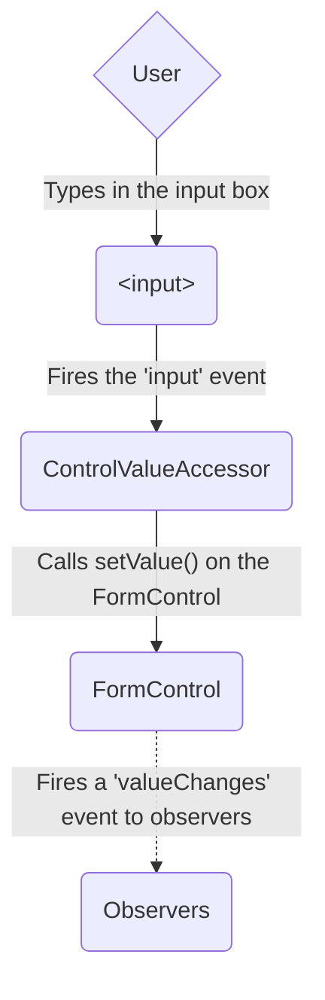
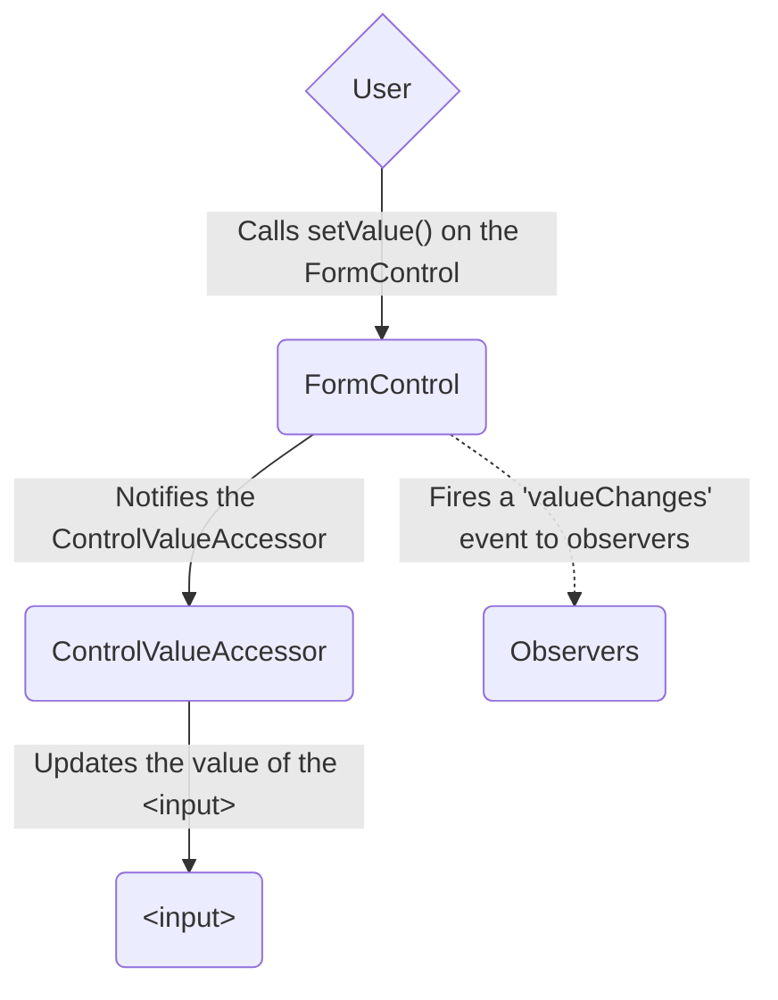
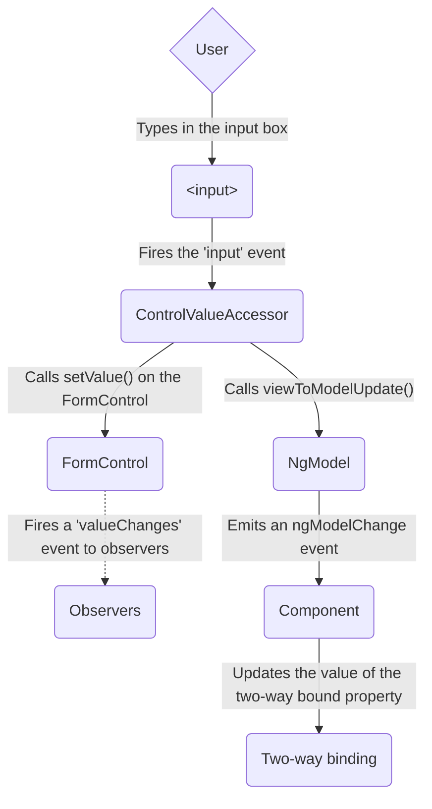
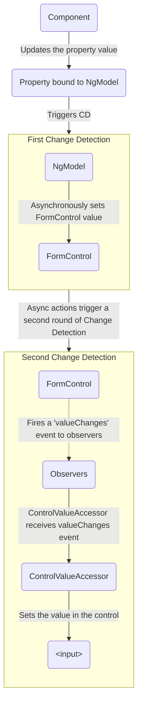

<docs-decorative-header title="Formها در Angular" imgSrc="adev/src/assets/images/overview.svg"> <!-- markdownlint-disable-line -->
مدیریت user input با formها، سنگ بنای بسیاری از applicationهای رایج است.
</docs-decorative-header>

Applicationها از formها استفاده می‌کنند تا کاربران بتوانند log in کنند، profile را به‌روزرسانی کنند، اطلاعات حساس وارد کنند و بسیاری از کارهای data-entry دیگر را انجام دهند.

Angular دو رویکرد متفاوت برای مدیریت user input از طریق formها فراهم می‌کند: reactive و template-driven.

هر دو رویکرد eventهای user input را از view دریافت می‌کنند، input را validate می‌کنند، form و data model می‌سازند و راهی برای track کردن changeها فراهم می‌کنند.

TIP: اگر دنبال Signal Forms جدید هستید، [راهنمای ضروری Signal Forms](/essentials/signal-forms) را ببینید!

این راهنما اطلاعاتی فراهم می‌کند تا بتوانید تصمیم بگیرید کدام نوع form برای وضعیت شما مناسب‌تر است.
این راهنما building blockهای مشترکی را معرفی می‌کند که هر دو رویکرد از آن‌ها استفاده می‌کنند.
همچنین تفاوت‌های کلیدی دو رویکرد را خلاصه می‌کند و این تفاوت‌ها را در context مربوط به setup، data flow و testing نشان می‌دهد.

## انتخاب رویکرد

Reactive formها و template-driven formها form data را به شکل متفاوتی پردازش و مدیریت می‌کنند.
هر رویکرد مزیت‌های متفاوتی دارد.

| Forms                 | Details                                                                                                                                                                                                                                                                                                                                                                                |
| :-------------------- | :------------------------------------------------------------------------------------------------------------------------------------------------------------------------------------------------------------------------------------------------------------------------------------------------------------------------------------------------------------------------------------- |
| Reactive forms        | دسترسی مستقیم و explicit به object model زیربنایی form فراهم می‌کنند. در مقایسه با template-driven formها robustتر هستند: scalableتر، reusableتر و testableترند. اگر formها بخش کلیدی application شما هستند، یا از قبل برای ساخت application خود از reactive patternها استفاده می‌کنید، از reactive formها استفاده کنید. |
| Template-driven forms | برای ساخت و دستکاری object model زیربنایی به directiveهای داخل template متکی هستند. برای اضافه کردن یک form ساده به app، مثل signup form برای email list، مفیدند. اضافه کردنشان به app ساده است، اما به‌اندازه reactive formها scale نمی‌شوند. اگر requirementهای form بسیار پایه‌ای دارید و logic می‌تواند فقط در template مدیریت شود، template-driven formها می‌توانند مناسب باشند. |

### تفاوت‌های کلیدی

جدول زیر تفاوت‌های کلیدی بین reactive formها و template-driven formها را خلاصه می‌کند.

|                                                   | Reactive                         | Template-driven                   |
| :------------------------------------------------ | :------------------------------- | :-------------------------------- |
| [Setup مربوط به form model](#setting-up-the-form-model) | Explicit، ساخته‌شده در component class | Implicit، ساخته‌شده توسط directiveها |
| [Data model](#mutability-of-the-data-model)       | Structured و immutable           | Unstructured و mutable            |
| [Data flow](#data-flow-in-forms)                  | Synchronous                      | Asynchronous                      |
| [Form validation](#form-validation)               | Functionها                       | Directiveها                       |

### Scalability

اگر formها بخش مرکزی application شما هستند، scalability بسیار مهم است.
توانایی reuse کردن form modelها بین componentها حیاتی است.

Reactive formها از template-driven formها scalableترند.
آن‌ها دسترسی مستقیم به form API زیربنایی فراهم می‌کنند و بین view و data model از [synchronous data flow](#data-flow-in-reactive-forms) استفاده می‌کنند؛ همین ساخت formهای بزرگ‌مقیاس را آسان‌تر می‌کند.
Reactive formها برای testing به setup کمتری نیاز دارند، و برای تست درست form updateها و validation لازم نیست درک عمیقی از change detection داشته باشید.

Template-driven formها روی سناریوهای ساده تمرکز دارند و به همان اندازه reusable نیستند.
آن‌ها form API زیربنایی را abstract می‌کنند و بین view و data model از [asynchronous data flow](#data-flow-in-template-driven-forms) استفاده می‌کنند.
Abstraction مربوط به template-driven formها روی testing هم اثر می‌گذارد.
Testها برای درست اجرا شدن به اجرای دستی change detection وابستگی زیادی دارند و به setup بیشتری نیازمندند.

## Setup کردن form model

هر دو نوع reactive و template-driven form، changeهای value را بین form input elementهایی که کاربران با آن‌ها تعامل دارند و form data داخل component model شما track می‌کنند.
این دو رویکرد building blockهای زیربنایی مشترکی دارند، اما در نحوه ساخت و مدیریت instanceهای common form-control متفاوت‌اند.

### کلاس‌های پایه مشترک form

هر دو نوع reactive و template-driven form بر پایه classهای زیر ساخته شده‌اند.

| Base classes           | Details                                                                                 |
| :--------------------- | :-------------------------------------------------------------------------------------- |
| `FormControl`          | Value و validation status یک form control مستقل را track می‌کند.                        |
| `FormGroup`            | همان valueها و status را برای مجموعه‌ای از form controlها track می‌کند.                 |
| `FormArray`            | همان valueها و status را برای arrayای از form controlها track می‌کند.                   |
| `ControlValueAccessor` | بین instanceهای Angular `FormControl` و DOM elementهای built-in یک bridge می‌سازد.      |

### Setup در reactive forms

در reactive formها، form model را مستقیما در component class تعریف می‌کنید.
Directive مربوط به `[formControl]` با استفاده از یک value accessor داخلی، instanceای از `FormControl` را که به‌صورت explicit ساخته شده به یک form element مشخص در view link می‌کند.

Component زیر با استفاده از reactive formها یک input field برای یک control واحد پیاده‌سازی می‌کند.
در این مثال، form model همان instance مربوط به `FormControl` است.

<docs-code language="angular-ts" path="adev/src/content/examples/forms-overview/src/app/reactive/favorite-color/favorite-color.component.ts"/>

IMPORTANT: در reactive formها، form model منبع truth است؛ form model در هر لحظه از زمان، از طریق directive مربوط به `[formControl]` روی element `<input>`، value و status مربوط به form element را فراهم می‌کند.

### Setup در template-driven forms

در template-driven formها، form model به‌جای explicit بودن، implicit است.
Directive مربوط به `NgModel` برای یک form element مشخص، instanceای از `FormControl` را می‌سازد و مدیریت می‌کند.

Component زیر همان input field را برای یک control واحد، با استفاده از template-driven formها پیاده‌سازی می‌کند.

<docs-code language="angular-ts" path="adev/src/content/examples/forms-overview/src/app/template/favorite-color/favorite-color.component.ts"/>

IMPORTANT: در یک template-driven form، منبع truth همان template است. Directive مربوط به `NgModel`، instance مربوط به `FormControl` را به‌صورت خودکار برای شما مدیریت می‌کند.

## Data flow در formها

وقتی یک application شامل form است، Angular باید view را با component model و component model را با view هماهنگ نگه دارد.
وقتی کاربران از طریق view مقدارها را تغییر می‌دهند و انتخاب انجام می‌دهند، valueهای جدید باید در data model منعکس شوند.
به همین شکل، وقتی program logic مقدارها را در data model تغییر می‌دهد، آن valueها باید در view منعکس شوند.

Reactive formها و template-driven formها در نحوه مدیریت جریان data از کاربر یا از تغییرات programmatic متفاوت‌اند.
Diagramهای زیر هر دو نوع data flow را برای هر نوع form، با استفاده از input field مربوط به favorite-color که بالاتر تعریف شد، نشان می‌دهند.

### Data flow در reactive forms

در reactive formها، هر form element در view مستقیما به form model، یعنی یک instance از `FormControl`، link شده است.
Updateها از view به model و از model به view synchronous هستند و به نحوه render شدن UI وابسته نیستند.

Diagram مربوط به view-to-model نشان می‌دهد وقتی value یک input field از view تغییر می‌کند، data از طریق مراحل زیر جریان پیدا می‌کند:

1. کاربر valueای را داخل input element تایپ می‌کند؛ در این مورد رنگ مورد علاقه _Blue_.
1. Form input element یک event از نوع "input" با آخرین value emit می‌کند.
1. `ControlValueAccessor` که به eventهای form input element گوش می‌دهد، value جدید را بلافاصله به instance مربوط به `FormControl` منتقل می‌کند.
1. Instance مربوط به `FormControl`، value جدید را از طریق observable مربوط به `valueChanges` emit می‌کند.
1. هر subscriber مربوط به observable `valueChanges`، value جدید را دریافت می‌کند.

Diagram مربوط به model-to-view نشان می‌دهد یک تغییر programmatic در model چطور از طریق مراحل زیر به view منتقل می‌شود.

1. کاربر method مربوط به `favoriteColorControl.setValue()` را call می‌کند که value مربوط به `FormControl` را به‌روزرسانی می‌کند.
1. Instance مربوط به `FormControl`، value جدید را از طریق observable مربوط به `valueChanges` emit می‌کند.
1. هر subscriber مربوط به observable `valueChanges`، value جدید را دریافت می‌کند.
1. Control value accessor روی form input element، element را با value جدید به‌روزرسانی می‌کند.

### Data flow در template-driven forms

در template-driven formها، هر form element به directiveای link می‌شود که form model را به‌صورت داخلی مدیریت می‌کند.

Diagram مربوط به view-to-model نشان می‌دهد وقتی value یک input field از view تغییر می‌کند، data از طریق مراحل زیر جریان پیدا می‌کند.

1. کاربر _Blue_ را داخل input element تایپ می‌کند.
1. Input element یک event از نوع "input" با value برابر _Blue_ emit می‌کند.
1. Control value accessor متصل به input، method مربوط به `setValue()` را روی instance مربوط به `FormControl` trigger می‌کند.
1. Instance مربوط به `FormControl`، value جدید را از طریق observable مربوط به `valueChanges` emit می‌کند.
1. هر subscriber مربوط به observable `valueChanges`، value جدید را دریافت می‌کند.
1. Control value accessor همچنین method مربوط به `NgModel.viewToModelUpdate()` را call می‌کند که eventای از نوع `ngModelChange` emit می‌کند.
1. چون component template از two-way data binding برای property مربوط به `favoriteColor` استفاده می‌کند، property مربوط به `favoriteColor` در component با value emitشده توسط event مربوط به `ngModelChange` به‌روزرسانی می‌شود \(_Blue_\).

Diagram مربوط به model-to-view نشان می‌دهد وقتی `favoriteColor` از _Blue_ به _Red_ تغییر می‌کند، data از طریق مراحل زیر از model به view جریان پیدا می‌کند.

1. Value مربوط به `favoriteColor` در component به‌روزرسانی می‌شود.
1. Change detection شروع می‌شود.
1. در طول change detection، lifecycle hook مربوط به `ngOnChanges` روی instance مربوط به directive `NgModel` call می‌شود، چون value یکی از inputهای آن تغییر کرده است.
1. Method مربوط به `ngOnChanges()` یک async task را queue می‌کند تا value مربوط به instance داخلی `FormControl` را تنظیم کند.
1. Change detection کامل می‌شود.
1. در tick بعدی، task مربوط به تنظیم value instance مربوط به `FormControl` اجرا می‌شود.
1. Instance مربوط به `FormControl` آخرین value را از طریق observable مربوط به `valueChanges` emit می‌کند.
1. هر subscriber مربوط به observable `valueChanges`، value جدید را دریافت می‌کند.
1. Control value accessor، form input element داخل view را با آخرین value مربوط به `favoriteColor` به‌روزرسانی می‌کند.

NOTE: `NgModel` یک change detection دوم trigger می‌کند تا از errorهای `ExpressionChangedAfterItHasBeenChecked` جلوگیری شود، چون تغییر value از یک input binding سرچشمه می‌گیرد.

### Mutability مربوط به data model

روش change-tracking در efficiency application شما نقش دارد.

| Forms                 | Details                                                                                                                                                                                                                                                                                                                                                                                                                                                                        |
| :-------------------- | :----------------------------------------------------------------------------------------------------------------------------------------------------------------------------------------------------------------------------------------------------------------------------------------------------------------------------------------------------------------------------------------------------------------------------------------------------------------------------- |
| Reactive forms        | Data model را با فراهم کردن آن به‌عنوان یک data structure immutable، pure نگه می‌دارند. هر بار که changeای روی data model trigger شود، instance مربوط به `FormControl` به‌جای update کردن data model موجود، یک data model جدید برمی‌گرداند. این کار به شما امکان می‌دهد changeهای یکتا را از طریق observable کنترل track کنید. Change detection کارآمدتر است چون فقط لازم است روی changeهای یکتا update شود. چون data updateها از reactive patternها پیروی می‌کنند، می‌توانید با observable operatorها برای transform کردن data integrate شوید. |
| Template-driven forms | برای update کردن data model در component هم‌زمان با changeهای ایجادشده در template، به mutability همراه با two-way data binding متکی هستند. چون هنگام استفاده از two-way data binding، change یکتایی برای track کردن روی data model وجود ندارد، change detection در تشخیص زمان لازم برای updateها efficiency کمتری دارد.                                                                                                                               |

این تفاوت در مثال‌های قبلی که از input element مربوط به favorite-color استفاده می‌کنند نشان داده شده است.

- در reactive formها، **instance مربوط به `FormControl`** هر بار که value کنترل update می‌شود، همیشه یک value جدید برمی‌گرداند
- در template-driven formها، **property مربوط به favorite color** همیشه به value جدیدش modify می‌شود

## Form validation

Validation بخش جدایی‌ناپذیر مدیریت هر مجموعه‌ای از formهاست.
چه required fieldها را بررسی کنید و چه برای username موجود از یک API خارجی query بگیرید، Angular مجموعه‌ای از validatorهای built-in و همچنین قابلیت ساخت validatorهای سفارشی را فراهم می‌کند.

| Forms                 | Details                                                                                                      |
| :-------------------- | :----------------------------------------------------------------------------------------------------------- |
| Reactive forms        | Validatorهای سفارشی را به‌عنوان **function**هایی تعریف می‌کنند که control مورد validation را دریافت می‌کنند |
| Template-driven forms | به **directive**های template گره خورده‌اند و باید custom validator directiveهایی فراهم کنند که validation functionها را wrap می‌کنند |

برای اطلاعات بیشتر، [Form Validation](guide/forms/form-validation#validating-input-in-reactive-forms) را ببینید.

## Testing

Testing در applicationهای پیچیده نقش بزرگی دارد.
وقتی می‌خواهید درست کار کردن formهای خود را validate کنید، testing strategy ساده‌تر مفید است.
Reactive formها و template-driven formها در میزان وابستگی به render شدن UI برای انجام assertionها بر اساس form control و form field changeها متفاوت‌اند.
مثال‌های زیر فرایند تست formها با reactive formها و template-driven formها را نشان می‌دهند.

### تست reactive forms

Reactive formها testing strategy نسبتا ساده‌ای فراهم می‌کنند، چون دسترسی synchronous به form و data modelها می‌دهند و می‌توان آن‌ها را بدون render کردن UI تست کرد.
در این testها، status و data از طریق control query و manipulate می‌شوند، بدون interaction با چرخه change detection.

Testهای زیر از componentهای favorite-color در مثال‌های قبلی استفاده می‌کنند تا data flowهای view-to-model و model-to-view را برای یک reactive form verify کنند.

<!--todo: make consistent with other topics -->

#### Verify کردن data flow از view به model

مثال اول مراحل زیر را برای verify کردن data flow از view به model انجام می‌دهد.

1. View را برای form input element query کنید و یک event سفارشی از نوع "input" برای test بسازید.
1. Value جدید input را روی _Red_ بگذارید و event مربوط به "input" را روی form input element dispatch کنید.
1. Assert کنید که value مربوط به `favoriteColorControl` در component با value داخل input match است.

<docs-code header="Favorite color test - view to model" path="adev/src/content/examples/forms-overview/src/app/reactive/favorite-color/favorite-color.component.spec.ts" region="view-to-model"/>

مثال بعدی مراحل زیر را برای verify کردن data flow از model به view انجام می‌دهد.

1. از `favoriteColorControl`، یعنی یک instance از `FormControl`، برای تنظیم value جدید استفاده کنید.
1. View را برای form input element query کنید.
1. Assert کنید که value جدید تنظیم‌شده روی control با value داخل input match است.

<docs-code header="Favorite color test - model to view" path="adev/src/content/examples/forms-overview/src/app/reactive/favorite-color/favorite-color.component.spec.ts" region="model-to-view"/>

### تست template-driven forms

نوشتن test با template-driven formها به دانش دقیق درباره فرایند change detection و درک اینکه directiveها در هر cycle چطور اجرا می‌شوند نیاز دارد، تا مطمئن شوید elementها در زمان درست query، test یا change می‌شوند.

Testهای زیر از componentهای favorite color که قبل‌تر ذکر شدند استفاده می‌کنند تا data flowها از view به model و از model به view را برای یک template-driven form verify کنند.

Test زیر data flow از view به model را verify می‌کند.

<docs-code header="Favorite color test - view to model" path="adev/src/content/examples/forms-overview/src/app/template/favorite-color/favorite-color.component.spec.ts" region="view-to-model"/>

این‌ها مراحلی هستند که در test مربوط به view to model انجام می‌شوند.

1. View را برای form input element query کنید و یک event سفارشی از نوع "input" برای test بسازید.
1. Value جدید input را روی _Red_ بگذارید و event مربوط به "input" را روی form input element dispatch کنید.
1. Change detection را از طریق test fixture اجرا کنید.
1. Assert کنید که value property مربوط به `favoriteColor` در component با value داخل input match است.

Test زیر data flow از model به view را verify می‌کند.

<docs-code header="Favorite color test - model to view" path="adev/src/content/examples/forms-overview/src/app/template/favorite-color/favorite-color.component.spec.ts" region="model-to-view"/>

این‌ها مراحلی هستند که در test مربوط به model to view انجام می‌شوند.

1. از component instance برای تنظیم value مربوط به property `favoriteColor` استفاده کنید.
1. Change detection را از طریق test fixture اجرا کنید.
1. از `await fixture.whenStable()` استفاده کنید تا منتظر rendering بعدی بمانید.
1. View را برای form input element query کنید.
1. Assert کنید که input value با value مربوط به property `favoriteColor` در component instance match است.

## قدم بعدی

برای یادگیری بیشتر درباره reactive formها، راهنماهای زیر را ببینید:

<docs-pill-row>
  <docs-pill href="guide/forms/reactive-forms" title="Reactive forms"/>
  <docs-pill href="guide/forms/form-validation#validating-input-in-reactive-forms" title="Form validation"/>
  <docs-pill href="guide/forms/dynamic-forms" title="Dynamic forms"/>
</docs-pill-row>

برای یادگیری بیشتر درباره template-driven formها، راهنماهای زیر را ببینید:

<docs-pill-row>
  <docs-pill href="guide/forms/template-driven-forms" title="Template Driven Forms tutorial" />
  <docs-pill href="guide/forms/form-validation#validating-input-in-template-driven-forms" title="Form validation" />
  <docs-pill href="api/forms/NgForm" title="NgForm directive API reference" />
</docs-pill-row>
