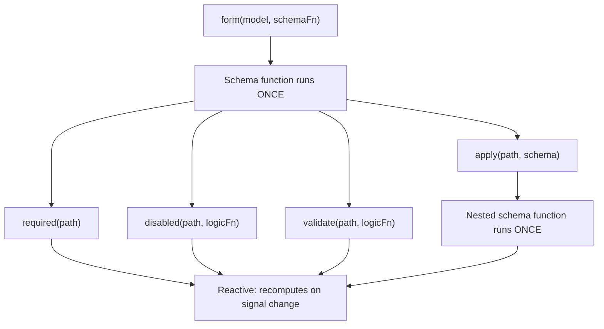

# Schemaها و composability مربوط به schema

Signal Forms از یک architecture دولایه استفاده می‌کند تا _ساختار form شما_ را از _رفتار آن در runtime_ جدا کند.

وقتی یک schema function به `form()` پاس می‌دهید، آن function هنگام ساخت form _یک بار_ اجرا می‌شود. کار آن setup کردن logic tree مربوط به form است؛ با declare کردن اینکه کدام fieldها validation دارند، کدام fieldها disabled هستند و کدام fieldها به fieldهای دیگر وابسته‌اند. این بخش **structural layer** فرم شماست.

داخل یک schema function، rule functionهایی مثل `disabled()` و `validate()` را call می‌کنید. این rule functionها reactive logic می‌پذیرند که هر زمان signalهایی که به آن‌ها ارجاع می‌دهند تغییر کنند دوباره compute می‌شود. Ruleهای شرطی مثل `disabled()` و `required()` configuration اختیاری می‌پذیرند، از جمله functionای به نام `when` که rule را فعال می‌کند. این‌ها با هم **behavioral layer** form شما را در runtime تشکیل می‌دهند.

```ts
contactForm = form(this.contactModel, (schemaPath) => {
  // Schema function: runs ONCE during form creation
  required(schemaPath.name);
  disabled(schemaPath.couponCode, {when: ({valueOf}) => valueOf(schemaPath.total) < 50});
  //  ^^^ Reactive logic: recomputes when total changes
});
```



این تمایز هنگام compose کردن schemaها مهم است، چون functionهایی مثل `apply()`، `applyWhen()` و `schema()` همه در structural layer عمل می‌کنند. Schemaها کنترل می‌کنند _کدام_ ruleها وجود دارند و _آیا_ active هستند، در حالی که rule functionها تعریف می‌کنند آن ruleها _چه چیزی_ را evaluate کنند.

## ساخت schemaهای reusable با `schema()`

وقتی چند form ruleهای یکسانی برای یک data shape مشترک دارند، می‌توانید از function مربوط به `schema()` استفاده کنید تا آن ruleها را به یک schema reusable استخراج کنید.

```ts
import {schema, required, minLength} from '@angular/forms/signals';

const nameSchema = schema<{first: string; last: string}>((name) => {
  required(name.first);
  required(name.last);
  minLength(name.first, 2);
  minLength(name.last, 2);
});
```

Function مربوط به `schema()` یک function را wrap می‌کند و آن را به objectای reusable از نوع `Schema<T>` تبدیل می‌کند. مثل هر schema function دیگر، برای هر form _یک بار_ اجرا می‌شود، اما خود object می‌تواند بین هر تعداد form که نیاز دارید share شود.

TIP: اگر ruleها فقط در یک محل ظاهر می‌شوند، inline schema function هم به همان خوبی کار می‌کند. وقتی می‌خواهید یک schema یکسان را بین چند form reuse کنید یا یک schema یکسان را روی چند path اعمال کنید، از `schema()` استفاده کنید. Objectهای reusable از نوع `Schema` برای هر form compilation cache می‌شوند.

### استفاده از schema با `apply()`

می‌توانید با استفاده از function مربوط به `apply()` یک schema reusable را روی path مشخصی در form اعمال کنید. وقتی `apply()` را call می‌کنید، schema یک scoped path دریافت می‌کند که فقط fieldهای داخل همان sub-path را می‌بیند:

```ts
import {apply} from '@angular/forms/signals';

profileForm = form(this.profileModel, (schemaPath) => {
  apply(schemaPath.name, nameSchema);
});

registrationForm = form(this.registrationModel, (schemaPath) => {
  apply(schemaPath.name, nameSchema);
});
```

## Schemaهای شرطی با `applyWhen()`

NOTE: [راهنمای اضافه کردن form logic](guide/forms/signals/form-logic)، `applyWhen()` را برای ruleهای شرطی با inline logic معرفی کرد. این بخش توضیح می‌دهد چطور `applyWhen()` را با schemaهای reusable compose کنید.

بعضی ruleها فقط باید تحت شرایط خاصی اعمال شوند. برای مثال، یک zip code field ممکن است فقط وقتی به validation نیاز داشته باشد که کشور انتخاب‌شده United States باشد.

Function مربوط به `applyWhen()` یک schema را بر اساس reactive state به‌صورت شرطی اعمال می‌کند. سه argument می‌پذیرد:

1. Pathای که schema روی آن اعمال شود
1. یک reactive logic function که وقتی schema باید active باشد `true` برمی‌گرداند
1. یک schema یا schema function که ruleهای شرطی را در خود دارد

```ts
import {form, applyWhen, required, pattern} from '@angular/forms/signals';

addressForm = form(this.addressModel, (schemaPath) => {
  applyWhen(
    schemaPath,
    ({valueOf}) => valueOf(schemaPath.country) === 'US',
    (schemaPath) => {
      required(schemaPath.zipCode);
      pattern(schemaPath.zipCode, /^\d{5}(-\d{4})?$/);
    },
  );
});
```

Logic function یک `FieldContext` دریافت می‌کند که دسترسی به `value`، `valueOf`، `stateOf` و helperهای reactive دیگر را فراهم می‌کند. چون reactive است، هر زمان signalهایی که می‌خواند تغییر کنند، condition دوباره evaluate می‌شود. وقتی condition به `false` تبدیل شود، ruleهای داخل schema deactivate می‌شوند. وقتی دوباره `true` شود، دوباره reactivate می‌شوند.

خود schema همچنان structural است؛ schema function هنگام ساخت form یک بار اجرا می‌شود. Condition کنترل می‌کند آیا آن ruleها _active_ هستند یا نه، نه اینکه آیا _وجود دارند_ یا نه.

داخل conditional schema، از scoped path parameterای استفاده کنید که به همان schema function پاس داده شده است. Pathهای schema بیرونی داخل nested schema معتبر نیستند.

### ترکیب `applyWhen()` با schemaهای reusable

چون `applyWhen()` یک object از نوع `Schema` می‌پذیرد، می‌توانید آن را با `schema()` جفت کنید تا schemaهای reusable را به‌صورت شرطی اعمال کنید:

```ts
const usZipCodeSchema = schema<{zipCode: string}>((address) => {
  required(address.zipCode);
  pattern(address.zipCode, /^\d{5}(-\d{4})?$/);
});

const caPostalCodeSchema = schema<{postalCode: string}>((address) => {
  required(address.postalCode);
  pattern(address.postalCode, /^[A-Z]\d[A-Z] \d[A-Z]\d$/);
});

shippingForm = form(this.shippingModel, (schemaPath) => {
  applyWhen(
    schemaPath.address,
    ({valueOf}) => valueOf(schemaPath.country) === 'US',
    usZipCodeSchema,
  );
  applyWhen(
    schemaPath.address,
    ({valueOf}) => valueOf(schemaPath.country) === 'CA',
    caPostalCodeSchema,
  );
});
```

NOTE: Logic function به `valueOf(schemaPath.country)` دسترسی دارد، حتی با اینکه path argument برابر `schemaPath.address` است. دلیلش این است که helper مربوط به `valueOf` می‌تواند به هر field در form دسترسی داشته باشد، نه فقط fieldهای داخل scoped path.

این pattern، validation logic را modular نگه می‌دارد؛ ruleهای address مربوط به هر country در schema خودش قرار می‌گیرد و form بر اساس انتخاب کاربر تصمیم می‌گیرد کدام را active کند.

## Type-narrowing با `applyWhenValue()`

Function مربوط به `applyWhenValue()` conditionهایی را ساده می‌کند که فقط لازم دارند value همان field را بررسی کنند. به‌جای دریافت `FieldContext`، condition function مستقیما raw value مربوط به field را دریافت می‌کند.

```ts {header: "applyWhen — logic function receives FieldContext"}
applyWhen(schemaPath.payment, ({value}) => value().type === 'credit-card', creditCardSchema);
```

```ts {header: "applyWhenValue — condition receives the value directly"}
applyWhenValue(schemaPath.payment, (payment) => payment.type === 'credit-card', creditCardSchema);
```

مزیت اصلی `applyWhenValue()` پشتیبانی از TypeScript type guard است. وقتی condition function یک type guard باشد، type parameter مربوط به schema به guarded type narrow می‌شود. این موضوع مخصوصا برای discriminated unionها مفید است، جایی که هر variant fieldهای متفاوتی دارد که ruleهای متفاوتی نیاز دارند.

```ts
import {form, applyWhenValue, required} from '@angular/forms/signals';

interface CreditCard {
  type: 'credit-card';
  cardNumber: string;
  expiry: string;
  cvv: string;
}

interface BankTransfer {
  type: 'bank-transfer';
  accountNumber: string;
  routingNumber: string;
}

type PaymentMethod = CreditCard | BankTransfer;

function isCreditCard(value: PaymentMethod): value is CreditCard {
  return value.type === 'credit-card';
}

function isBankTransfer(value: PaymentMethod): value is BankTransfer {
  return value.type === 'bank-transfer';
}

paymentForm = form(this.paymentModel, (schemaPath) => {
  applyWhenValue(schemaPath, isCreditCard, (payment) => {
    // TypeScript knows payment is scoped to CreditCard
    required(payment.cardNumber);
    required(payment.expiry);
    required(payment.cvv);
  });

  applyWhenValue(schemaPath, isBankTransfer, (payment) => {
    // TypeScript knows payment is scoped to BankTransfer
    required(payment.accountNumber);
    required(payment.routingNumber);
  });
});
```

بدون type guard، TypeScript نمی‌داند داخل هر schema function کدام fieldها در دسترس‌اند. Type narrowing مطمئن می‌کند دسترسی به `payment.cardNumber` در branch مربوط به credit card و `payment.accountNumber` در branch مربوط به bank transfer، type-safe است.

## Array itemها با `applyEach()`

وقتی یک form شامل arrayای از objectهاست، اغلب لازم دارید ruleهای یکسانی روی همه itemها اعمال شود. Function مربوط به `applyEach()` یک schema را روی هر item داخل یک array field اعمال می‌کند، صرف‌نظر از اینکه چند item وجود داشته باشد.

```ts
import {form, applyEach, required, min} from '@angular/forms/signals';

type LineItem = {name: string; quantity: number};

orderForm = form(this.orderModel, (schemaPath) => {
  required(schemaPath.title);

  applyEach(schemaPath.items, (item) => {
    required(item.name);
    min(item.quantity, 1);
  });
});
```

Schema functionای که به `applyEach()` پاس داده می‌شود یک `SchemaPathTree` دریافت می‌کند که scope آن به یک array item محدود است. Ruleهایی که داخل آن declare می‌شوند روی هر item در array اعمال می‌شوند، از جمله itemهایی که بعد از ساخت form اضافه می‌شوند.

### ترکیب `applyEach()` با schemaهای reusable

چون `applyEach()` یک object از نوع `Schema` می‌پذیرد، می‌توانید ruleهای item-level را به یک schema reusable استخراج کنید و بین formها share کنید:

```ts
const lineItemSchema = schema<LineItem>((item) => {
  required(item.name);
  min(item.quantity, 1);
});

orderForm = form(this.orderModel, (schemaPath) => {
  required(schemaPath.title);
  applyEach(schemaPath.items, lineItemSchema);
});

invoiceForm = form(this.invoiceModel, (schemaPath) => {
  required(schemaPath.invoiceNumber);
  applyEach(schemaPath.lineItems, lineItemSchema);
});
```

TIP: برای اطلاعات بیشتر درباره validate کردن array itemها، از جمله custom error message برای هر field، [راهنمای Validation](guide/forms/signals/validation) را ببینید.

## قدم بعدی

برای یادگیری بیشتر درباره Signal Forms، این راهنماهای مرتبط را ببینید:

- [Adding form logic](guide/forms/signals/form-logic) - یاد بگیرید چطور conditional logic، dynamic behavior و metadata به formهای خود اضافه کنید
- [Validation](guide/forms/signals/validation) - درباره validation ruleها و error handling یاد بگیرید
- [Async operations](guide/forms/signals/async-operations) - یاد بگیرید چطور form submission و async validation را مدیریت کنید
