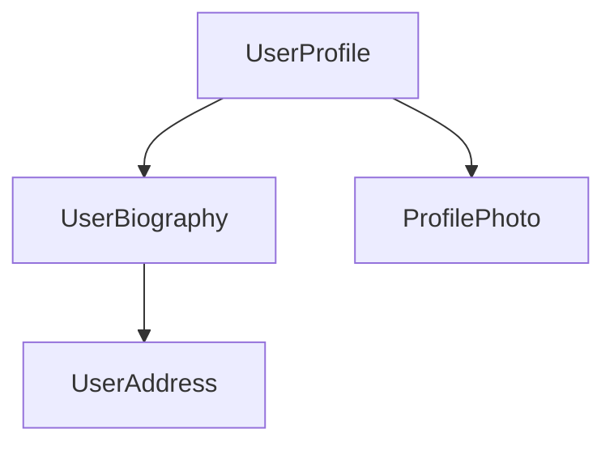

<docs-decorative-header title="کامپوننت‌ها" imgSrc="adev/src/assets/images/components.svg"> <!-- markdownlint-disable-line -->
building block بنیادی برای ساخت برنامه‌ها در Angular.
</docs-decorative-header>

کامپوننت‌ها building blockهای اصلی برنامه‌های Angular هستند. هر کامپوننت بخشی از یک صفحه وب بزرگ‌تر را نمایش می‌دهد. سازمان‌دهی برنامه به کامپوننت‌ها به پروژه شما ساختار می‌دهد و کد را به بخش‌های مشخصی جدا می‌کند که نگهداری و گسترش آن‌ها در طول زمان ساده‌تر است.

## تعریف یک کامپوننت

هر کامپوننت چند بخش اصلی دارد:

1. یک [decorator](https://www.typescriptlang.org/docs/handbook/decorators.html) به نام `@Component` که شامل بخشی از پیکربندی مورد استفاده Angular است.
2. یک template از جنس HTML که کنترل می‌کند چه چیزی در DOM render شود.
3. یک [CSS selector](https://developer.mozilla.org/docs/Learn/CSS/Building_blocks/Selectors) که مشخص می‌کند کامپوننت چطور در HTML استفاده می‌شود.
4. یک class در TypeScript با رفتارهایی مثل مدیریت ورودی کاربر یا ارسال request به server.

این یک نمونه ساده‌شده از کامپوننت `UserProfile` است.

```angular-ts
// user-profile.ts
@Component({
  selector: 'user-profile',
  template: `
    <h1>User profile</h1>
    <p>This is the user profile page</p>
  `,
})
export class UserProfile {
  /* Your component code goes here */
}
```

decorator مربوط به `@Component` همچنین به صورت اختیاری propertyای به نام `styles` می‌پذیرد تا هر CSSای را که می‌خواهید روی template اعمال کنید، در آن قرار دهید:

```angular-ts
// user-profile.ts
@Component({
  selector: 'user-profile',
  template: `
    <h1>User profile</h1>
    <p>This is the user profile page</p>
  `,
  styles: `
    h1 {
      font-size: 3em;
    }
  `,
})
export class UserProfile {
  /* Your component code goes here */
}
```

### جدا کردن HTML و CSS در فایل‌های جداگانه

می‌توانید HTML و CSS یک کامپوننت را با استفاده از `templateUrl` و `styleUrl` در فایل‌های جداگانه تعریف کنید:

```angular-ts
// user-profile.ts
@Component({
  selector: 'user-profile',
  templateUrl: 'user-profile.html',
  styleUrl: 'user-profile.css',
})
export class UserProfile {
  // Component behavior is defined in here
}
```

```angular-html
<!-- user-profile.html -->
<h1>User profile</h1>
<p>This is the user profile page</p>
```

```css
/* user-profile.css */
h1 {
  font-size: 3em;
}
```

## استفاده از کامپوننت‌ها

شما با ترکیب چند کامپوننت کنار هم یک برنامه می‌سازید. برای مثال، اگر در حال ساخت صفحه پروفایل کاربر باشید، ممکن است صفحه را به چند کامپوننت مثل این تقسیم کنید:



در اینجا کامپوننت `UserProfile` برای ساخت صفحه نهایی از چند کامپوننت دیگر استفاده می‌کند.

برای import و استفاده از یک کامپوننت، باید:

1. در فایل TypeScript کامپوننت خود، یک statement از نوع `import` برای کامپوننتی که می‌خواهید استفاده کنید اضافه کنید.
2. در decorator مربوط به `@Component`، کامپوننتی را که می‌خواهید استفاده کنید به آرایه `imports` اضافه کنید.
3. در template کامپوننت خود، یک element اضافه کنید که با selector کامپوننت مورد نظر مطابقت داشته باشد.

این نمونه‌ای از کامپوننت `UserProfile` است که کامپوننت `ProfilePhoto` را import می‌کند:

```angular-ts
// user-profile.ts
import {ProfilePhoto} from 'profile-photo.ts';

@Component({
  selector: 'user-profile',
  imports: [ProfilePhoto],
  template: `
    <h1>User profile</h1>
    <profile-photo />
    <p>This is the user profile page</p>
  `,
})
export class UserProfile {
  // Component behavior is defined in here
}
```

TIP: می‌خواهید درباره کامپوننت‌های Angular بیشتر بدانید؟ برای جزئیات کامل، [راهنمای عمیق کامپوننت‌ها](guide/components) را ببینید.

## قدم بعدی

حالا که می‌دانید کامپوننت‌ها در Angular چطور کار می‌کنند، وقت آن است یاد بگیریم چطور داده‌های پویا را در برنامه اضافه و مدیریت کنیم.

<docs-pill-row>
  <docs-pill title="واکنش‌پذیری با Signalها" href="essentials/signals" />
  <docs-pill title="راهنمای عمیق کامپوننت‌ها" href="guide/components" />
</docs-pill-row>

