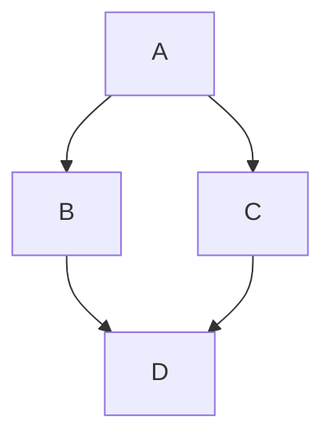
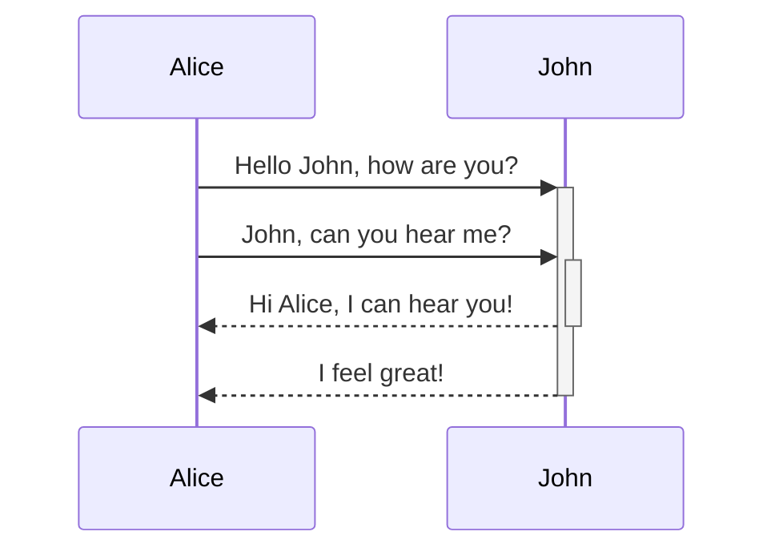
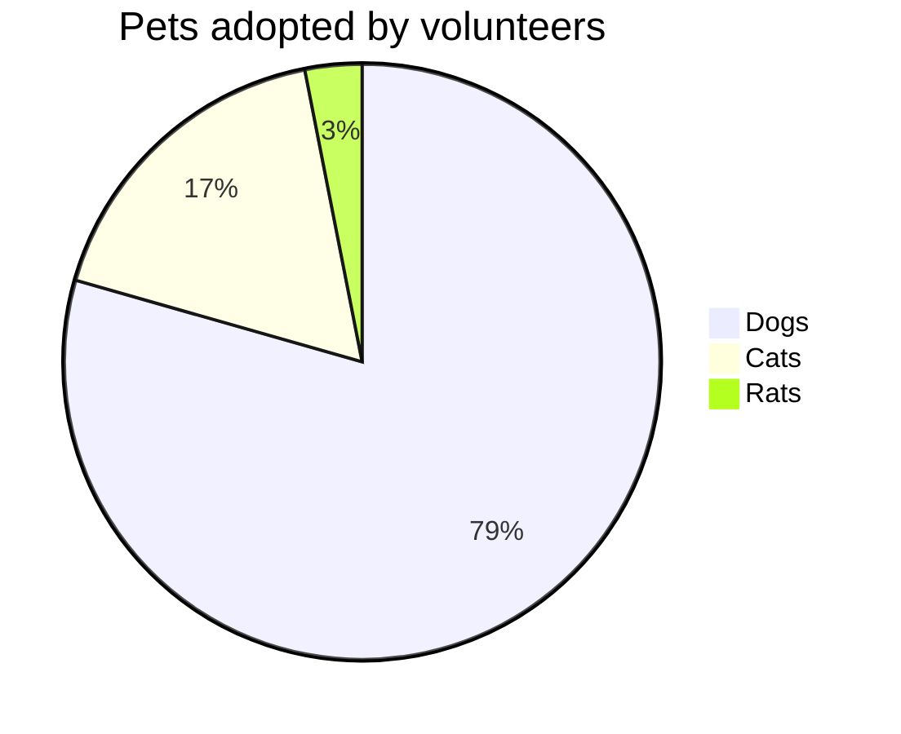

<docs-decorative-header title="مجموعه کامل مؤلفه‌ها" imgSrc="adev/src/assets/images/components.svg"> <!-- markdownlint-disable-line -->
این صفحه فهرستی بصری از همه componentها و styleهای سفارشی Angular.dev است.
</docs-decorative-header>

این صفحه به‌عنوان یک design system، راهنمای بصری و نگارش Markdown را برای موارد زیر ارائه می‌کند:

- elementهای سفارشی مستندات انگولار: [`docs-card`](#cards)، ‏[`docs-callout`](#callouts)، ‏[`docs-pill`](#pills) و [`docs-steps`](#workflow)
- elementهای سفارشی متن: [هشدارها](#alerts)
- نمونه‌های کد: [`docs-code`](#code)
- elementهای دارای style داخلی Markdown: لینک‌ها، فهرست‌ها، [headerها](#headers-h2) و [خطوط افقی](#horizontal-line-divider)
- و موارد بیشتر!

آماده شوید تا:

1. مستنداتی...
2. عالی...
3. بنویسید!

## Headerها (h2)

### Headerهای کوچک‌تر (h3)

#### حتی کوچک‌تر (h4)

##### باز هم کوچک‌تر (h5)

###### کوچک‌ترین! (h6)

## Cardها

<docs-card-container>
  <docs-card title="انگولار چیست؟" link="مرور کلی پلتفرم" href="tutorials/first-app">
    این متن نمونه محتوای card است و برای نمایش ظاهر و چیدمان آن استفاده می‌شود.
  </docs-card>
  <docs-card title="Card دوم" link="همین حالا امتحان کنید" href="essentials/what-is-angular">
    این متن نمونه محتوای card است و برای نمایش ظاهر و چیدمان آن استفاده می‌شود.
  </docs-card>
    <docs-card title="Card بدون لینک">
    این متن نمونه محتوای card است و برای نمایش ظاهر و چیدمان آن استفاده می‌شود.
  </docs-card>
</docs-card-container>

### attributeهای `<docs-card>`

| attributeها             | جزئیات                                            |
| :---------------------- | :------------------------------------------------ |
| `<docs-card-container>` | همه cardها باید داخل یک container قرار گیرند      |
| `title`                 | عنوان card                                        |
| محتوای بدنه card        | هر چیزی میان `<docs-card>` و `</docs-card>`       |
| `link`                  | متن اختیاری لینک دعوت به اقدام                    |
| `href`                  | آدرس اختیاری لینک دعوت به اقدام                   |

## Calloutها

<docs-callout title="عنوان یک callout راهنما">
  این متن نمونه محتوای callout است و برای نمایش ظاهر، فاصله‌ها و نحوه قرارگیری محتوای طولانی در آن استفاده می‌شود.
</docs-callout>

<docs-callout critical title="عنوان یک callout بحرانی">
  این متن نمونه محتوای callout است و برای نمایش ظاهر، فاصله‌ها و نحوه قرارگیری محتوای طولانی در آن استفاده می‌شود.
</docs-callout>

<docs-callout important title="عنوان یک callout مهم">
  این متن نمونه محتوای callout است و برای نمایش ظاهر، فاصله‌ها و نحوه قرارگیری محتوای طولانی در آن استفاده می‌شود.
</docs-callout>

### attributeهای `<docs-callout>`

| attributeها                                     | جزئیات                                                     |
| :---------------------------------------------- | :---------------------------------------------------------- |
| `title`                                         | عنوان callout                                               |
| محتوای بدنه card                               | هر چیزی میان `<docs-callout>` و `</docs-callout>`           |
| `helpful` (پیش‌فرض) \| `critical` \| `important` | style و icon را بر اساس سطح اهمیت اضافه می‌کند              |

## Pillها

ردیف‌های pill نوعی navigation مفید برای لینک دادن به resourceهای کاربردی هستند.

<docs-pill-row id=pill-row>
  <docs-pill href="#pill-row" title="لینک"/>
  <docs-pill href="#pill-row" title="لینک"/>
  <docs-pill href="#pill-row" title="لینک"/>
  <docs-pill href="#pill-row" title="لینک"/>
  <docs-pill href="#pill-row" title="لینک"/>
  <docs-pill href="#pill-row" title="لینک"/>
</docs-pill-row>

### attributeهای `<docs-pill>`

| attributeها       | جزئیات                                              |
| :---------------- | :-------------------------------------------------- |
| `<docs-pill-row>` | همه pillها باید داخل یک ردیف pill قرار گیرند        |
| `title`           | متن pill                                            |
| `href`            | آدرس pill                                           |

امکان استفاده مستقل و inline از pillها نیز وجود دارد، اما هنوز این حالت را به‌طور کامل پیاده‌سازی نکرده‌ایم.

## هشدارها

هشدارها paragraphهای ویژه‌ای هستند. آن‌ها برای برجسته کردن موضوعی فوری‌تر مفیدند و نباید با callout اشتباه گرفته شوند. اندازه font را از context می‌گیرند و در سطح‌های مختلف در دسترس‌اند. از هشدارها برای render کردن حجم زیادی از محتوا استفاده نکنید؛ آن‌ها را برای تأکید و جلب توجه به محتوای اطراف به کار ببرید.

در Markdown، هشدار را از خط جدید و با format برابر `SEVERITY_LEVEL` + `:` + `ALERT_TEXT` بنویسید.

NOTE: از Note برای اطلاعات جانبی یا تکمیلی استفاده کنید که برای متن اصلی _ضروری_ نیست.

TIP: از Tip برای برجسته کردن task یا action مشخصی که کاربران می‌توانند انجام دهند، یا واقعیتی که مستقیماً به آن task یا action مربوط است استفاده کنید.

TODO: از TODO برای مستندات ناتمامی استفاده کنید که قصد دارید به‌زودی گسترش دهید. همچنین می‌توانید TODO را به کسی اختصاص دهید؛ برای نمونه TODO(emmatwersky): Text.

QUESTION: از Question برای مطرح کردن پرسشی کوتاه از خواننده استفاده کنید؛ شبیه آزمونی کوچک که باید بتواند پاسخ دهد.

SUMMARY: از Summary برای خلاصه دو یا سه‌جمله‌ای صفحه یا محتوای بخش استفاده کنید تا خوانندگان تشخیص دهند در محل مناسبی هستند یا خیر.

TLDR: اگر می‌توانید اطلاعات ضروری صفحه یا بخش را در یک یا دو جمله ارائه کنید، از TL;DR \(یا TLDR\) استفاده کنید. برای نمونه: TLDR: Rhubarb یک گربه است.

CRITICAL: از Critical برای برجسته کردن خطرهای احتمالی یا هشدار به خواننده پیش از انجام کاری استفاده کنید. برای نمونه: Warning: اجرای `rm` با گزینه `-f` فایل‌ها یا دایرکتوری‌های محافظت‌شده در برابر نوشتن را بدون درخواست تأیید حذف می‌کند.

IMPORTANT: از Important برای اطلاعاتی استفاده کنید که درک متن یا تکمیل یک task به آن‌ها وابسته است.

HELPFUL: از Best practice برای معرفی روش‌هایی استفاده کنید که موفقیت آن‌ها اثبات شده یا از گزینه‌های جایگزین بهترند.

NOTE: توجه کنید `developers`! هشدارها _می‌توانند_ [لینک](#alerts) و styleهای تودرتوی دیگری داشته باشند \(اما **در استفاده از این قابلیت زیاده‌روی نکنید**\).

## کد

می‌توانید `code` را با سه backtick داخلی نمایش دهید:

```ts
example code
```

یا از element به نام `<docs-code>` استفاده کنید.

<docs-code header="نخستین نمونه شما" language="ts" linenums>
import { Component } from '@angular/core';

@Component({
selector: 'example-code',
template: '<h1>Hello World!</h1>',
})
export class ComponentOverviewComponent {}
</docs-code>

### styleدهی نمونه

نمونه کدی با همه styleها:

<docs-code
  path="adev/src/content/examples/hello-world/src/app/app.component-old.ts"
  header="یک نمونه کد styleدهی‌شده"
  language='ts'
  linenums
  highlight="[[3,7], 9]"
  preview
  visibleLines="[3,10]">
</docs-code>

برای terminal نیز style داریم؛ کافی است language را روی `shell` قرار دهید:

```shell
npm install @angular/material --save
```

برای نمایش بهتر می‌توانید سه backtick استاندارد Markdown را با attributeها styleدهی کنید:

```ts {header:"Awesome Title", linenums, highlight="[2]", hideCopy}
console.log('Hello, World!');
console.log('Awesome Angular Docs!');
```

#### attributeهای `<docs-code>`

| attributeها    | نوع                  | جزئیات                                                       |
| :------------- | :------------------- | :------------------------------------------------------------ |
| code           | `string`             | هر چیزی میان tagها به‌عنوان کد در نظر گرفته می‌شود           |
| `path`         | `string`             | مسیر نمونه کد \(ریشه: `content/examples/`\)                   |
| `header`       | `string`             | عنوان نمونه \(پیش‌فرض: `file-name`\)                          |
| `language`     | `string`             | زبان کد                                                       |
| `linenums`     | `boolean`            | \(False\) شماره خط‌ها را نمایش می‌دهد                          |
| `highlight`    | `string of number[]` | خط‌های برجسته‌شده                                             |
| `diff`         | `string`             | مسیر کد تغییرکرده                                             |
| `visibleLines` | `string of number[]` | بازه خط‌ها برای حالت collapse                                 |
| `region`       | `string`             | فقط region ارائه‌شده را نمایش می‌دهد                          |
| `preview`      | `boolean`            | \(False\) preview را نمایش می‌دهد                              |
| `hideCode`     | `boolean`            | \(False\) مشخص می‌کند نمونه کد به‌طور پیش‌فرض collapse شود    |
| `hideDollar`   | `boolean`            | \(False\) علامت dollar را در نمونه‌های shell مخفی می‌کند      |

### نمونه‌های چندفایلی

با قرار دادن نمونه‌ها درون `<docs-code-multifile>` می‌توانید نمونه‌های چندفایلی ایجاد کنید.

<docs-code-multifile
  path="adev/src/content/examples/hello-world/src/app/app.component.ts"
  preview>
<docs-code
    path="adev/src/content/examples/hello-world/src/app/app.component.html"
    highlight="[1]"
    linenums/>
<docs-code
    path="adev/src/content/examples/hello-world/src/app/app.component.css" />
</docs-code-multifile>

#### attributeهای `<docs-code-multifile>`

| attributeها   | نوع       | جزئیات                                                       |
| :------------ | :-------- | :------------------------------------------------------------ |
| محتوای بدنه   | `string`  | tabهای تودرتوی نمونه‌های `docs-code`                          |
| `path`        | `string`  | مسیر نمونه کد برای preview و لینک خارجی                       |
| `preview`     | `boolean` | \(False\) preview را نمایش می‌دهد                              |
| `hideCode`    | `boolean` | \(False\) مشخص می‌کند نمونه کد به‌طور پیش‌فرض collapse شود    |
| `hideDollar`  | `boolean` | \(False\) علامت dollar را در نمونه‌های shell مخفی می‌کند      |

### افزودن `preview` به نمونه کد

افزودن flag به نام `preview` یک نمونه در حال اجرای کد را زیر snippet کد می‌سازد. همچنین دکمه‌ای برای باز کردن نمونه در حال اجرا در StackBlitz به‌طور خودکار اضافه می‌شود.

NOTE: قابلیت `preview` فقط با standalone کار می‌کند.

### styleدهی preview نمونه‌ها با Tailwind CSS

classهای utility مربوط به Tailwind را می‌توان در نمونه‌های کد استفاده کرد.

<docs-code-multifile
  path="adev/src/content/examples/hello-world/src/app/tailwind-app.component.ts"
  preview>
<docs-code path="adev/src/content/examples/hello-world/src/app/tailwind-app.component.html" />
<docs-code path="adev/src/content/examples/hello-world/src/app/tailwind-app.component.ts" />
</docs-code-multifile>

## Tabها

<docs-tab-group>
  <docs-tab label="نمونه کد">
    <docs-code-multifile
      path="adev/src/content/examples/hello-world/src/app/tailwind-app.component.ts"
      hideCode="true"
      preview>
    <docs-code path="adev/src/content/examples/hello-world/src/app/tailwind-app.component.html" />
    <docs-code path="adev/src/content/examples/hello-world/src/app/tailwind-app.component.ts" />
    </docs-code-multifile>
  </docs-tab>
  <docs-tab label="مقداری متن">
    این متن نمونه برای نمایش نحوه قرارگیری محتوای متنی در tab و بررسی style، فاصله‌ها و چیدمان آن استفاده می‌شود.
  </docs-tab>
</docs-tab-group>

## گردش‌کار

مراحل شماره‌دار را با `<docs-step>` styleدهی کنید. شماره‌گذاری با CSS ایجاد می‌شود و بسیار کاربردی است.

### attributeهای `<docs-workflow>` و `<docs-step>`

| attributeها        | جزئیات                                           |
| :----------------- | :------------------------------------------------ |
| `<docs-workflow>`  | همه مراحل باید داخل یک workflow قرار گیرند       |
| `title`            | عنوان مرحله                                      |
| محتوای بدنه مرحله  | هر چیزی میان `<docs-step>` و `</docs-step>`      |

مرحله‌ها باید از خط جدید آغاز شوند و می‌توانند شامل `docs-code`ها و elementها و styleهای تودرتوی دیگر باشند.

<docs-workflow>

<docs-step title="نصب Angular CLI">
  از Angular CLI برای ایجاد پروژه‌ها، تولید کد application و کتابخانه و انجام taskهای مداوم توسعه مانند testing، ‏bundling و deployment استفاده می‌کنید.

برای نصب Angular CLI، یک پنجره terminal باز و فرمان زیر را اجرا کنید:

```shell
npm install -g @angular/cli
```

</docs-step>

<docs-step title="ایجاد workspace و application اولیه">
  applicationها را در context مربوط به workspace انگولار توسعه می‌دهید.

برای ایجاد workspace جدید و application اولیه:

- فرمان CLI به نام `ng new` را اجرا و مانند زیر نام `my-app` را ارائه کنید:

  ```shell
  ng new my-app
  ```

- فرمان ng new درباره قابلیت‌های قابل افزودن به application اولیه پرسش‌هایی مطرح می‌کند. با فشردن کلید Enter یا Return مقادیر پیش‌فرض را بپذیرید.

  Angular CLI، ‏packageهای لازم Angular npm و dependencyهای دیگر را نصب می‌کند. این فرایند ممکن است چند دقیقه طول بکشد.

  CLI یک workspace جدید و application ساده Welcome می‌سازد که آماده اجرا است.
  </docs-step>

<docs-step title="اجرای application">
  Angular CLI شامل serverای برای build و serve کردن محلی application است.

1. به پوشه workspace مانند `my-app` بروید.
2. فرمان زیر را اجرا کنید:

   ```shell
   cd my-app
   ng serve --open
   ```

فرمان `ng serve`، ‏server را راه‌اندازی می‌کند، فایل‌ها را زیر نظر می‌گیرد و با تغییر آن‌ها application را دوباره می‌سازد.

گزینه `--open` \(یا فقط `-o`\) مرورگر را به‌طور خودکار در <http://localhost:4200/> باز می‌کند.
اگر نصب و راه‌اندازی موفق بوده باشد، باید صفحه‌ای مشابه نمونه مشاهده کنید.
</docs-step>

<docs-step title="مرحله پایانی">
  این‌ها همه componentهای مستندات بودند! اکنون:

  <docs-pill-row>
    <docs-pill href="#pill-row" title="بروید"/>
    <docs-pill href="#pill-row" title="مستنداتی"/>
    <docs-pill href="#pill-row" title="عالی"/>
    <docs-pill href="#pill-row" title="بنویسید!"/>
  </docs-pill-row>
</docs-step>

</docs-workflow>

## تصویر و ویدئو

می‌توانید تصویرها را با syntax معنایی تصویر در Markdown اضافه کنید:


### افزودن `#small` و `#medium` برای تغییر اندازه تصویر


## افزودن attribute با syntax مربوط به curly brace


ویدئوهای embedشده با `docs-video` ایجاد می‌شوند و فقط به `src` و `alt` نیاز دارند:

<docs-video src="https://www.youtube.com/embed/O47uUnJjbJc" alt=""/>

## Chartها و graphها

برای نوشتن diagram و chart با [Mermaid](http://mermaid.js.org/)، ‏language کد را روی `mermaid` قرار دهید؛ همه themeها به‌صورت داخلی فراهم شده‌اند.







## جداکننده خط افقی

می‌توان از این مورد برای جدا کردن بخش‌های صفحه، مانند کاری که در ادامه انجام می‌دهیم، استفاده کرد. این styleها به‌طور پیش‌فرض اضافه می‌شوند و به تنظیم سفارشی نیازی نیست.

<hr/>

پایان!

## ترجیح داده‌شده / پرهیز شود

```ts {prefer}
const foo = 'bar';
```

```ts {avoid}
const bar = 'foo';
```

```ts {avoid, header: 'with a header'}
const baz = 42;
```

<docs-code
  path="adev/src/content/examples/hello-world/src/app/app.component-old.ts"
  header="یک نمونه کد styleدهی‌شده"
  language='ts'
  linenums
  highlight="[[3,7], 9]"
  prefer>
</docs-code>
